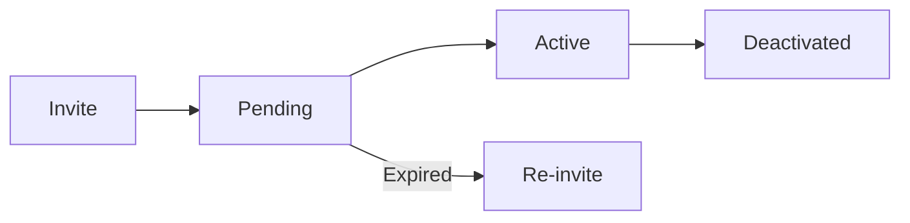

# User Management

Manage users, roles, and permissions across your organization.

## User Lifecycle

## Inviting Users

### Single Invitation

1. Go to **Organization Settings** → **Users**
2. Click **Invite User**
3. Enter:
   - Email address
   - Organization role
   - Workspace access
4. Click **Send Invitation**

### Bulk Invitation

1. Click **Bulk Invite**
2. Upload CSV with emails
3. Set default role
4. Send invitations

## User Roles

### Organization Roles

| Role | Description |
|------|-------------|
| **Org Admin** | Full organization management |
| **Member** | Standard organization member |

### Workspace Roles

| Role | Capabilities |
|------|--------------|
| **Admin** | Full workspace control, settings access |
| **Editor** | Create, edit, delete all content |
| **Contributor** | Create, edit assigned content |
| **Viewer** | Read-only access |

## Permission Matrix

| Action | Admin | Editor | Contributor | Viewer |
|--------|-------|--------|-------------|--------|
| View content | ✅ | ✅ | ✅ | ✅ |
| Create content | ✅ | ✅ | ✅ | ❌ |
| Edit any content | ✅ | ✅ | ❌ | ❌ |
| Edit assigned | ✅ | ✅ | ✅ | ❌ |
| Delete content | ✅ | ✅ | ❌ | ❌ |
| Manage settings | ✅ | ❌ | ❌ | ❌ |
| Manage users | ✅ | ❌ | ❌ | ❌ |

## Managing Workspace Access

### Grant Access

1. Open workspace settings
2. Go to **Users**
3. Click **Add User**
4. Select user and role
5. Save

### Modify Access

1. Click on user
2. Change role
3. Save

### Revoke Access

1. Select user
2. Click **Remove Access**
3. Confirm

## User Status

| Status | Meaning |
|--------|---------|
| **Active** | User can log in and access |
| **Pending** | Invitation sent, not accepted |
| **Deactivated** | Access suspended |

## Deactivating Users

When someone leaves:

1. Go to **Users**
2. Select user
3. Click **Deactivate**
4. User loses access but data is preserved

## Audit Trail

Track user actions:

- Login history
- Content changes
- Permission changes

Access via **Organization Settings** → **Audit Log**

## Best Practices

1. **Least privilege** — Give minimum necessary access
2. **Regular review** — Audit user access periodically
3. **Prompt deactivation** — Remove access when people leave
4. **Document roles** — Define what each role should do
5. **Use workspace roles** — Don't make everyone org admin

## Next Steps

- [Content Hub](./content-hub) — Templates and marketplace
- [Organization Settings](./organization-settings) — Return to org settings
