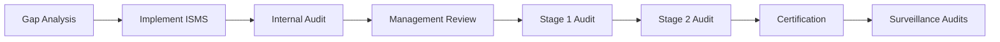

# ISO 27001 Compliance with Gover

ISO 27001 is the international standard for information security management systems (ISMS).

## Overview

| Attribute | Value |
|-----------|-------|
| **Full Name** | ISO/IEC 27001:2022 |
| **Type** | International Standard |
| **Publisher** | ISO/IEC |
| **Certification** | Available through accredited bodies |

## Structure

### Main Clauses (4-10)

- Context of the organization
- Leadership
- Planning
- Support
- Operation
- Performance evaluation
- Improvement

### Annex A Controls

93 controls organized in 4 themes:

- Organizational controls (37)
- People controls (8)
- Physical controls (14)
- Technological controls (34)

## Key Requirements

### ISMS Requirements

- Define scope
- Create an information security policy
- Risk assessment
- Risk treatment
- Statement of Applicability (SoA)
- Continuous improvement

### Annex A Control Domains

| Domain | Controls |
|--------|----------|
| **A.5 Organizational** | Policies, roles, responsibilities |
| **A.6 People** | Screening, awareness, training |
| **A.7 Physical** | Security areas, equipment, utilities |
| **A.8 Technological** | Access control, cryptography, operations |

## Using Gover for ISO 27001

### 1. Add the Framework

1. Go to **Frameworks** → **Add Framework**
2. Select **ISO 27001:2022** from templates
3. Add to your workspace

### 2. Define Your Scope

Document your ISMS scope:

- Organizational boundaries
- Information assets
- Locations
- Technologies

### 3. Perform Risk Assessment

Use Gover's risk management:

1. Identify information security risks
2. Assess likelihood and impact
3. Determine risk levels
4. Plan treatment actions

### 4. Create Statement of Applicability (SoA)

Map controls to requirements:

- Mark applicable controls
- Document justification for exclusions
- Map to implemented controls

### 5. Implement Controls

For each Annex A control:

1. Create or map existing controls
2. Map evidence documents
3. Assign owners
4. Track implementation

## Certification Journey

## Recommended Approach

1. **Gap Analysis** — Assess current state against ISO 27001
2. **Risk Assessment** — Identify and assess risks
3. **Control Implementation** — Address gaps
4. **Documentation** — Create required documents
5. **Internal Audit** — Verify compliance
6. **Certification Audit** — External assessment

## Key Documents

| Document | Purpose |
|----------|---------|
| **ISMS Policy** | High-level information security commitment |
| **Risk Assessment** | Documented risk analysis |
| **Statement of Applicability (SoA)** | Control applicability |
| **Risk Treatment Plan** | How risks are addressed |
| **Internal Audit Reports** | Audit findings |

## Resources

- [ISO 27001 Standard](https://www.iso.org/standard/27001)
- [ISO 27002 Guidance](https://www.iso.org/standard/75652.html)

## Next Steps

- [Risk Management](../user-guide/risks/overview) — Implement risk processes
- [Controls](../user-guide/controls/overview) — Manage your controls
