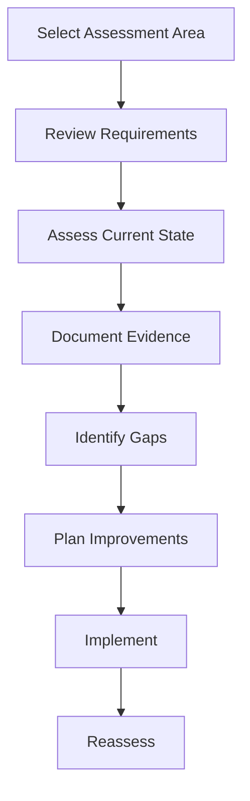

# Kybermittari with Gover

Kybermittari is Finland's national cybersecurity assessment tool.

## Overview

| Attribute | Value |
|-----------|-------|
| **Full Name** | Kybermittari (Cyber Meter) |
| **Jurisdiction** | Finland |
| **Publisher** | Traficom / NCSC-FI |
| **Type** | Self-assessment tool |

## Purpose

Kybermittari helps Finnish organizations:
- Assess cybersecurity maturity
- Identify improvement areas
- Benchmark against best practices
- Meet regulatory expectations

## Structure

### Assessment Areas

| Area | Focus |
|------|-------|
| **Governance** | Leadership, policies, organization |
| **Risk Management** | Risk identification and treatment |
| **Asset Management** | Inventory, classification |
| **Access Control** | Identity and access management |
| **Operations** | Security operations, monitoring |
| **Incident Management** | Detection, response, recovery |
| **Continuity** | Business continuity, disaster recovery |
| **Compliance** | Legal and regulatory requirements |

### Maturity Levels

| Level | Description |
|-------|-------------|
| **1 - Initial** | Ad hoc, reactive |
| **2 - Developing** | Basic processes defined |
| **3 - Defined** | Standardized processes |
| **4 - Managed** | Measured and controlled |
| **5 - Optimizing** | Continuous improvement |

## Using Gover for Kybermittari

### 1. Add the Framework

1. Go to **Frameworks** → **Add Framework**
2. Select **Kybermittari** from templates
3. Add to your workspace

### 2. Perform Self-Assessment

For each requirement:
1. Review the requirement
2. Assess your current maturity level
3. Document evidence
4. Identify gaps

### 3. Map Controls

Link your existing controls to Kybermittari requirements:
- Security policies
- Technical controls
- Processes and procedures

### 4. Track Improvement

Use Gover to:
- Monitor maturity progress
- Plan improvement initiatives
- Track implementation

## Assessment Process

## Alignment with Other Frameworks

Kybermittari aligns with:
- **ISO 27001** — Information security
- **NIS2** — EU cybersecurity directive
- **NIST CSF** — Cybersecurity framework

## Resources

- [Traficom Kybermittari](https://www.kyberturvallisuuskeskus.fi/fi/palvelumme/tilannekuva-ja-verkostojohtaminen/kybermittari)
- [NCSC-FI](https://www.kyberturvallisuuskeskus.fi/)

## Next Steps

- [NIS2](./nis2) — Related EU directive
- [ISO 27001](./iso-27001) — International security standard
