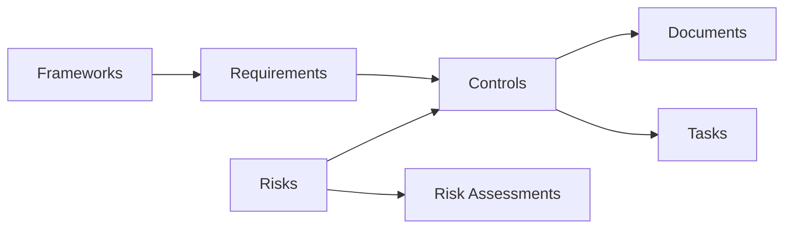

# Introduction to Gover

Welcome to **Gover** — the modern platform for Governance, Risk, and Compliance (GRC) management.

Gover helps organizations manage compliance frameworks, track risks, implement controls, and maintain documentation in one connected workspace.

## What is Gover?

Gover is a comprehensive GRC platform designed to simplify compliance management for organizations of all sizes. Whether you're working towards ISO 27001 certification, GDPR compliance, or managing multiple frameworks simultaneously, Gover provides the tools you need.

## Key Features

| Feature | Description |
|---------|-------------|
| **Framework Management** | Import and manage compliance frameworks like ISO 27001, GDPR, NIS2 |
| **Control Library** | Create, organize, and map controls to requirements |
| **Risk Management** | Identify, assess, and treat risks with customizable scoring |
| **Document Management** | Upload, create, and link evidence documents |
| **Task Management** | Track compliance tasks with Kanban and list views |
| **AI Assistant** | Get intelligent suggestions for mappings and compliance |

## Who is Gover for?

- **Compliance Officers** — Manage frameworks and track readiness
- **Risk Managers** — Assess and monitor organizational risks
- **IT Security Teams** — Implement and document security controls
- **Auditors** — Review compliance status and evidence
- **Management** — Get visibility into compliance posture

## Getting Help

- 📧 Email: [info@gover.io](mailto:info@gover.io)
- 🌐 Website: [gover.io](https://gover.io)
- 📱 App: [app.gover.io](https://app.gover.io)

Ready to get started? Continue to the [Quick Start Guide](./quick-start).
