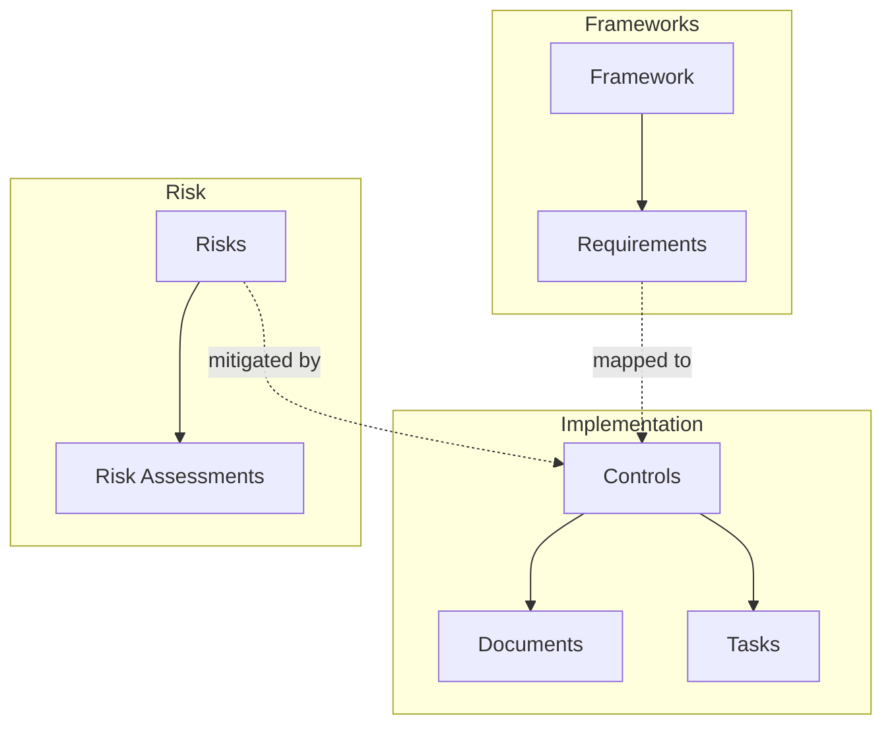

# Key Concepts

Understanding these core concepts will help you get the most out of Gover.

## The GRC Hierarchy

## Frameworks

A **Framework** is a structured set of requirements that define compliance standards. Examples include:

- **ISO 27001** — Information security management
- **GDPR** — Data protection regulation
- **NIS2** — Network and information security directive
- **SOC 2** — Service organization controls

Frameworks contain **Requirements** organized in a hierarchical structure (chapters, sections, articles).

## Requirements

**Requirements** are specific compliance criteria within a framework. Each requirement:

- Has a unique identifier (e.g., "A.5.1.1")
- Contains description and guidance
- Can be mapped to one or more controls
- Shows readiness status based on mapped controls

## Controls

**Controls** are the measures, policies, or procedures you implement to meet requirements. A control can:

- Map to multiple requirements across different frameworks
- Link to evidence documents
- Have associated tasks
- Be categorized and tagged

:::info Control Reuse
One control can satisfy requirements from multiple frameworks. For example, an "Access Control Policy" might satisfy requirements in both ISO 27001 and GDPR.
:::

## Risks

**Risks** represent potential threats to your organization. Each risk has:

- **Inherent Risk** — Risk level before controls
- **Residual Risk** — Risk level after controls are applied
- **Treatment Plan** — How you address the risk (mitigate, accept, transfer, avoid)

## Risk Assessments

**Risk Assessments** evaluate specific risks using customizable scoring fields:

- Impact and likelihood scores
- Custom assessment fields
- Calculated risk scores using formulas
- Risk level mappings (Critical, High, Medium, Low)

## Documents

**Documents** serve as evidence for your controls. They can be:

- Uploaded files (PDF, Word, etc.)
- Created directly in Gover's editor
- Linked to controls as evidence

## Tasks

**Tasks** track compliance activities and actions:

- Assigned to team members
- Have due dates and priorities
- Can be linked to controls, risks, or documents
- Managed via Kanban board or list view

## Mappings

**Mappings** are the connections between entities:

| From | To | Purpose |
|------|-----|---------|
| Requirement | Control | Shows how requirements are satisfied |
| Control | Document | Links evidence to controls |
| Control | Risk | Shows which controls mitigate risks |
| Control | Task | Tracks implementation work |

## Workspaces & Organizations

- **Organization** — Your company or entity in Gover
- **Workspace** — An isolated environment within an organization

Users can have different roles and permissions across workspaces.

## Content Hub

The **Content Hub** provides:

- **Templates** — Pre-built frameworks and controls
- **My Content** — Your published content
- **Discovery** — Community marketplace
- **Installed** — Content you've added to your workspace
