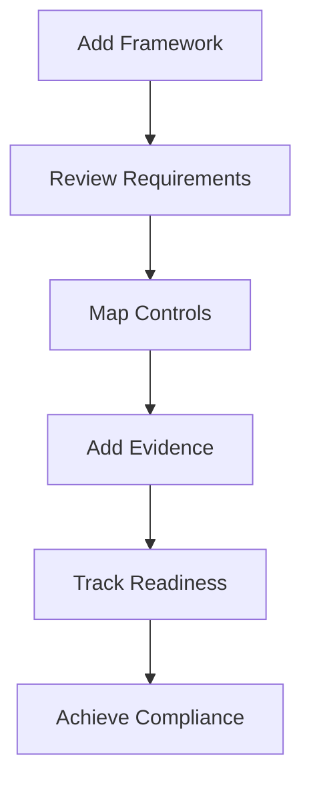

# Quick Start Guide

Get up and running with Gover in minutes.

## Step 1: Log In

1. Navigate to [app.gover.io](https://app.gover.io)
2. Sign in with your organization's SSO (Microsoft, Google, or email)
3. Complete MFA verification if enabled

## Step 2: Select Your Workspace

After logging in, you'll see your available workspaces. Each workspace is an isolated environment for managing compliance.

- **Select an existing workspace** to continue working
- **Create a new workspace** if you're starting fresh

:::tip
Workspaces are great for separating different business units, projects, or clients.
:::

## Step 3: Add Your First Framework

1. Navigate to **Frameworks** in the sidebar
2. Click **Add Framework**
3. Choose from:
   - **Templates** — Pre-built frameworks (ISO 27001, GDPR, NIS2, etc.)
   - **Content Hub** — Community and marketplace frameworks
   - **Custom** — Create your own framework

<!-- TODO: Add GIF showing framework addition -->

## Step 4: Review Requirements

Once a framework is added:

1. Click on the framework to open it
2. Browse the requirement tree structure
3. Each requirement shows its compliance status

## Step 5: Map Controls

Controls are the measures you implement to meet requirements.

1. Open a requirement
2. Click **Map Controls**
3. Select existing controls or create new ones
4. The requirement's readiness updates automatically

## Step 6: Track Progress

Use the **Home** dashboard to monitor:

- Overall compliance readiness
- Pending tasks
- Recent activity
- Risk overview

## Next Steps

- [Key Concepts](./key-concepts) — Understand Gover's core concepts
- [Frameworks Guide](../user-guide/frameworks/overview) — Deep dive into framework management
- [Controls Guide](../user-guide/controls/overview) — Learn about control management
