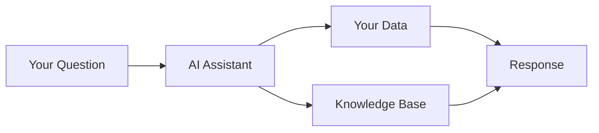

# AI Assistant Overview

Gover's AI Assistant helps you work smarter with intelligent suggestions and automation.

## What Can AI Do?

The AI Assistant helps with:

| Capability | Description |
|------------|-------------|
| **Mapping Suggestions** | Recommend control-to-requirement mappings |
| **Document Analysis** | Suggest document-to-control links |
| **Chat Interface** | Answer questions about your data |
| **Content Generation** | Help draft descriptions and content |

## AI Features

### Chat Assistant
Conversational interface to:
- Ask questions about your compliance data
- Get guidance on compliance topics
- Navigate to relevant items

### Smart Suggestions
Automated recommendations for:
- Control mappings to requirements
- Document mappings to controls
- Risk treatment options

### Content Assistance
Help with writing:
- Control descriptions
- Risk descriptions
- Document content

## How It Works

The AI:
1. Analyzes your question or context
2. Reviews your workspace data
3. Applies compliance knowledge
4. Provides relevant suggestions

## Privacy & Security

:::info Data Privacy
- AI runs on Azure OpenAI in EU (Sweden Central)
- No training on your data
- Prompts are not stored unless you save content
- Enterprise-grade security
:::

## Getting Started

1. Click the **AI Assistant** icon in the sidebar
2. Start a conversation or request suggestions
3. Review and apply recommendations

## Next Steps

- [Chat Interface](./chat) — Using the chat assistant
- [AI Suggestions](./suggestions) — Working with recommendations
- [Best Practices](./best-practices) — Getting the most from AI
