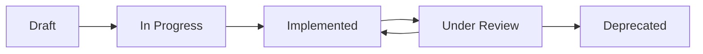

# Creating Controls

Learn how to add controls to your Gover workspace.

## Methods to Create Controls

### 1. Manual Creation

Create controls one at a time:

1. Navigate to **Controls** → **Add Control**
2. Fill in control details:
   - **Title** — Clear, descriptive name
   - **Description** — What the control does and how
   - **Category** — Organizational grouping
   - **Owner** — Responsible person
3. Click **Save**

<!-- TODO: Add GIF showing control creation -->

### 2. From Templates

Use pre-built control templates:

1. Go to **Controls** → **Templates**
2. Browse available templates by category
3. Click **Use Template**
4. Customize as needed
5. Save to your library

### 3. From Content Hub

Install controls from the marketplace:

1. Navigate to **Content Hub** → **Discovery**
2. Find control packs
3. Click **Install**
4. Controls are added to your library

### 4. Bulk Import

Import multiple controls at once:

1. Go to **Controls** → **Import**
2. Download the import template
3. Fill in your controls
4. Upload the file
5. Review and confirm

#### Import Template Format

| Column | Required | Description |
|--------|----------|-------------|
| `title` | Yes | Control name |
| `description` | No | Control description |
| `category` | No | Category name |
| `owner` | No | Owner email |

## Control Details

### Basic Information

- **Title** — Keep it concise but descriptive
- **Description** — Include:
  - What the control does
  - How it's implemented
  - Expected outcomes

### Categories

Organize controls into categories:

- Security controls
- Privacy controls
- Operational controls
- Technical controls
- Administrative controls

:::tip
Create a category structure that matches your organization's needs.
:::

### Custom Fields

Add custom fields for additional tracking:

- Implementation date
- Review frequency
- Compliance scope
- Risk rating

### Tags

Use tags for flexible grouping:

- Cross-cutting concerns
- Project associations
- Priority levels

## Best Practices

1. **Use clear naming** — "Access Control Policy" not "ACP-001"
2. **Be specific** — Describe exactly what the control does
3. **Assign owners** — Every control needs accountability
4. **Categorize consistently** — Use a standard category structure
5. **Link evidence** — Attach supporting documents

## Control Lifecycle

## Next Steps

- [Mapping Controls](./mapping) — Link controls to requirements
- [Control Testing](./testing) — Verify effectiveness
- [Categories](./categories) — Organize your controls
