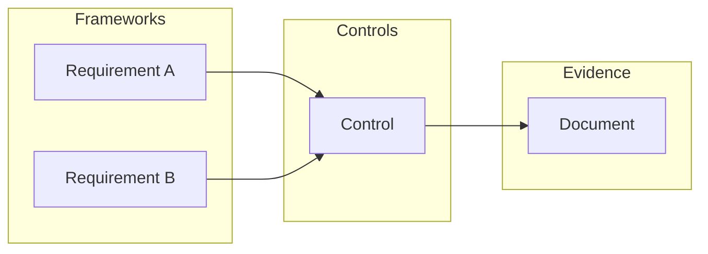

# Mapping Controls

Connect controls to requirements, risks, and documents to build your compliance picture.

## Why Mapping Matters

Mapping creates the connections that power Gover's compliance tracking:

## Mapping to Requirements

### From a Control

1. Open a control
2. Go to **Requirements** tab
3. Click **Map Requirements**
4. Select requirements from any framework
5. Confirm mapping

### From a Requirement

1. Open a requirement
2. Click **Map Controls**
3. Select existing controls or create new
4. Confirm mapping

### AI-Assisted Mapping

Let AI suggest relevant mappings:

1. Open a control or requirement
2. Click **AI Suggestions**
3. Review suggestions with confidence scores
4. Accept or reject each suggestion

:::info
AI analyzes text similarity, existing mappings, and industry patterns to make suggestions.
:::

## Mapping to Risks

Link controls to the risks they mitigate:

1. Open a control
2. Go to **Risks** tab
3. Click **Map Risks**
4. Select risks from your risk register
5. Confirm mapping

This shows:
- Which risks are mitigated by controls
- Control coverage for risk treatment
- Gaps in risk mitigation

## Mapping to Documents

Attach evidence documents to controls:

1. Open a control
2. Go to **Documents** tab
3. Click **Map Documents**
4. Select existing documents or upload new
5. Confirm mapping

### Document Types

| Type | Purpose |
|------|---------|
| **Policies** | Formal policy documents |
| **Procedures** | Step-by-step processes |
| **Records** | Evidence of execution |
| **Reports** | Audit and assessment reports |

## Mapping to Tasks

Link implementation and review tasks:

1. Open a control
2. Go to **Tasks** tab
3. Click **Map Tasks** or **Create Task**
4. Associate relevant tasks

## Viewing Mappings

### Control View
See all mappings for a single control:
- Requirements tab
- Risks tab
- Documents tab
- Tasks tab

### Matrix View
See mappings across multiple controls:
- Framework × Control matrix
- Risk × Control matrix

## Bulk Mapping

Map multiple items at once:

1. Select multiple controls (checkbox)
2. Click **Bulk Actions** → **Map**
3. Choose target requirements or risks
4. Apply to all selected

## Best Practices

1. **Map comprehensively** — Don't leave requirements unmapped
2. **Use AI suggestions** — Save time with intelligent recommendations
3. **Review periodically** — Mappings may need updates as controls change
4. **Document rationale** — Add comments explaining mapping decisions
5. **Avoid over-mapping** — Only map where there's a genuine relationship

## Next Steps

- [Control Testing](./testing) — Verify control effectiveness
- [Categories](./categories) — Organize your controls
