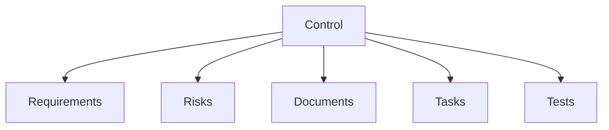

# Controls

Controls are the policies, procedures, and measures your organization implements to meet compliance requirements and mitigate risks.

## What is a Control?

A control is a safeguard or countermeasure designed to:

- Meet compliance requirements
- Mitigate identified risks
- Protect organizational assets
- Ensure operational integrity

## Control Library

Your control library is the central repository for all controls in your workspace.

### Views

| View | Description |
|------|-------------|
| **List View** | Sortable, filterable table of all controls |
| **Category View** | Controls organized by category |
| **Templates** | Pre-built control templates |

## Control Properties

Each control has:

| Property | Description |
|----------|-------------|
| **Title** | Control name |
| **Description** | Detailed explanation |
| **Category** | Organizational grouping |
| **Owner** | Responsible person |
| **Status** | Implementation status |
| **Custom Fields** | Additional tracking data |

## Control Relationships

Controls connect to other entities:

### Requirements

- Controls satisfy framework requirements
- One control can map to multiple requirements
- Cross-framework mapping supported

### Risks

- Controls mitigate identified risks
- Shows risk reduction impact
- Links to risk assessments

### Documents

- Documents support controls
- Policies, procedures, records
- Version tracking

### Tasks

- Implementation tasks
- Review and audit tasks
- Remediation actions

## Control Status

Track implementation progress:

| Status | Meaning |
|--------|---------|
| **Draft** | Control defined but not implemented |
| **In Progress** | Implementation underway |
| **Implemented** | Control is operational |
| **Under Review** | Scheduled for review |
| **Deprecated** | No longer in use |

## Key Actions

| Action | Description |
|--------|-------------|
| **Create** | Add new controls |
| **Import** | Bulk import from templates or files |
| **Map** | Link to requirements and risks |
| **Test** | Verify control effectiveness |
| **Export** | Generate control reports |

## Next Steps

- [Creating Controls](./creating-controls) — Add controls to your library
- [Mapping Controls](./mapping) — Link controls to requirements and risks
- [Control Testing](./testing) — Verify control effectiveness
