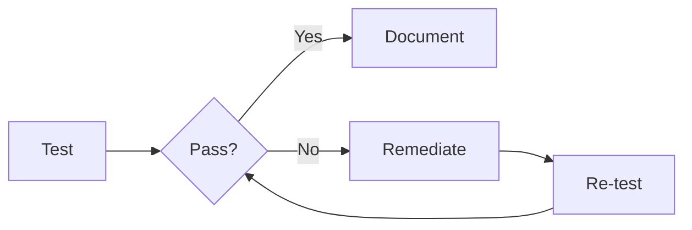

# Control Testing

Verify that your controls are operating effectively through testing.

## Why Test Controls?

Control testing ensures:
- Controls are implemented as designed
- Controls are operating effectively
- Evidence exists for auditors
- Gaps are identified early

## Test Types

| Type | Description | Frequency |
|------|-------------|-----------|
| **Design Test** | Verify control is properly designed | Once, on changes |
| **Operating Test** | Verify control works in practice | Periodic |
| **Compliance Test** | Verify adherence to requirements | As needed |

## Creating Tests

1. Open a control
2. Go to **Tests** tab
3. Click **Add Test**
4. Define test details:
   - Test name
   - Test procedure
   - Expected results
   - Frequency

## Recording Test Results

After performing a test:

1. Open the test
2. Click **Record Result**
3. Enter:
   - Test date
   - Tester name
   - Result (Pass/Fail)
   - Evidence/notes
4. Save result

## Test Status

| Status | Meaning |
|--------|---------|
| 🟢 **Passed** | Control operating effectively |
| 🔴 **Failed** | Control not operating as expected |
| 🟡 **Partial** | Some aspects passed, others need work |
| ⚪ **Not Tested** | Test not yet performed |

## Test History

View historical test results:
- Trend over time
- Pass/fail rates
- Tester information
- Evidence links

## Scheduling Tests

Set up recurring tests:

1. Open a control
2. Go to **Tests** tab
3. Click **Schedule**
4. Set frequency (monthly, quarterly, annually)
5. Assign responsible tester

## Remediation

When tests fail:

1. Document the failure
2. Create a remediation task
3. Assign to control owner
4. Track to completion
5. Re-test after remediation

## Best Practices

1. **Test regularly** — Don't wait for audits
2. **Document everything** — Keep evidence of all tests
3. **Use sampling** — For high-volume controls, test samples
4. **Independent testing** — Have someone other than the owner test
5. **Follow up on failures** — Track remediation to completion

## Next Steps

- [Categories](./categories) — Organize your controls
- [Risk Assessments](../risks/risk-assessments) — Link testing to risk management
