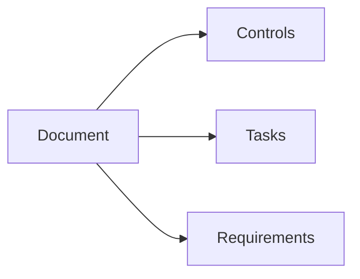

# Documents Overview

Documents in Gover serve as evidence for your controls and compliance activities.

## What are Documents?

Documents are files and content that support your compliance program:

- Policies and procedures
- Evidence records
- Audit reports
- Training materials
- Contracts

## Document Types

| Type | Description |
|------|-------------|
| **Uploaded** | Files uploaded to Gover (PDF, Word, etc.) |
| **Created** | Documents written in Gover's editor |
| **Linked** | References to external documents |

## Document Library

Navigate to **Documents** to see your document library.

### Views

- **List View** — Sortable, filterable table
- **Category View** — Organized by category

### Properties

| Property | Description |
|----------|-------------|
| **Title** | Document name |
| **Description** | Summary of contents |
| **Category** | Organizational grouping |
| **Owner** | Responsible person |
| **Version** | Document version |
| **Status** | Draft, Published, Archived |

## Document Relationships

Documents connect to:

- **Controls** — Evidence supporting controls
- **Tasks** — Task deliverables
- **Requirements** — Direct requirement evidence

## Key Actions

| Action | Description |
|--------|-------------|
| **Upload** | Add files to the library |
| **Create** | Write documents in Gover |
| **Map** | Link to controls and tasks |
| **Preview** | View document contents |
| **Export** | Download documents |

## Next Steps

- [Uploading Documents](./uploading) — Add files to Gover
- [Document Editor](./editor) — Create documents in Gover
- [Mapping Documents](./mapping) — Link documents to controls
