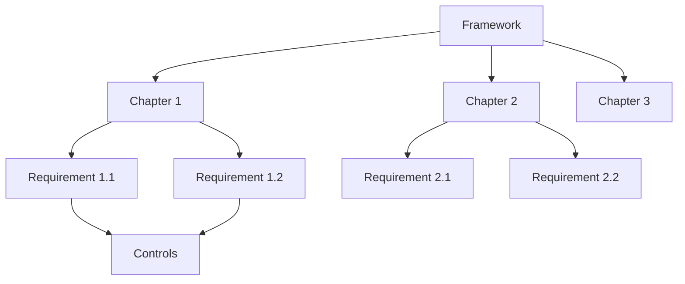

# Frameworks

Frameworks are the foundation of compliance management in Gover. They define the requirements your organization needs to meet.

## What is a Framework?

A compliance framework is a structured set of guidelines, requirements, and best practices that organizations follow to achieve and maintain compliance with regulations, standards, or industry practices.

## Supported Frameworks

Gover supports a wide range of frameworks:

| Framework | Type | Description |
|-----------|------|-------------|
| **ISO 27001** | Standard | Information security management system |
| **GDPR** | Regulation | EU data protection regulation |
| **NIS2** | Directive | EU network and information security directive |
| **Kybermittari** | Assessment | Finnish cybersecurity assessment tool |
| **CRA** | Regulation | EU Cyber Resilience Act |
| **ISO 9001** | Standard | Quality management system |
| **ISO 14001** | Standard | Environmental management system |
| **ISO 45001** | Standard | Occupational health and safety |
| **ISO 42001** | Standard | AI management system |

## Framework Views

### Card View

See all your frameworks at a glance with readiness indicators.

### Tree View

Navigate the hierarchical structure of requirements within a framework.

### Requirements List

View all requirements in a filterable, sortable list.

## Readiness Tracking

Each framework shows its compliance readiness:

- **Readiness %** — Percentage of requirements with mapped controls
- **Status indicators** — Visual progress for each section
- **Gap analysis** — Identify unmapped requirements

## Key Actions

| Action | Description |
|--------|-------------|
| **Add Framework** | Import from templates or create custom |
| **View Requirements** | Browse the requirement hierarchy |
| **Map Controls** | Link controls to requirements |
| **Track Progress** | Monitor compliance readiness |
| **Export** | Generate compliance reports |

## Next Steps

- [Adding Frameworks](./adding-frameworks) — Learn how to add frameworks
- [Requirements](./requirements) — Working with requirements
- [Readiness Tracking](./readiness-tracking) — Monitor your progress
