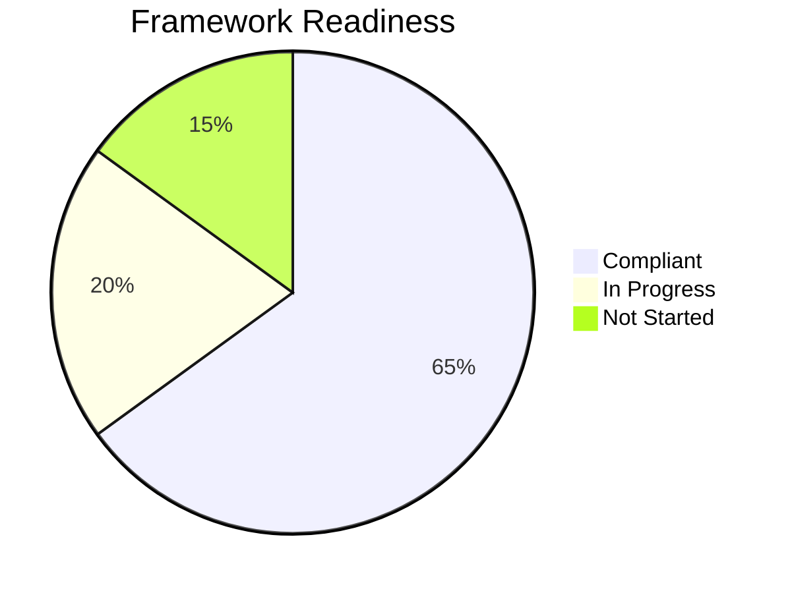

# Readiness Tracking

Monitor your organization's compliance progress across all frameworks.

## Readiness Overview

Gover calculates readiness based on how many requirements have mapped controls.



## Framework Readiness

Each framework displays:

- **Overall Readiness %** — Percentage of requirements addressed
- **Section Breakdown** — Readiness per chapter/section
- **Trend** — Progress over time

### Readiness Calculation

```
Readiness = (Requirements with Controls / Total Requirements) × 100
```

:::note
Requirements marked as "Not Applicable" are excluded from the calculation.
:::

## Dashboard Metrics

The Home dashboard shows:

| Metric | Description |
|--------|-------------|
| **Total Frameworks** | Number of active frameworks |
| **Average Readiness** | Mean readiness across frameworks |
| **Requirements Gap** | Count of unmapped requirements |
| **Recent Progress** | Changes in the last 30 days |

## Gap Analysis

Identify compliance gaps quickly:

1. Navigate to a framework
2. Filter requirements by **Status: Not Started**
3. Review unmapped requirements
4. Prioritize based on risk or audit timeline

## Progress Tracking

### Timeline View
See how readiness has changed over time:
- Weekly/monthly progress charts
- Milestone markers
- Trend analysis

### Activity Feed
Track recent compliance activities:
- New control mappings
- Status changes
- Team contributions

## Reporting

Generate compliance reports:

1. Go to **Frameworks** → select a framework
2. Click **Export** or **Reports**
3. Choose report type:
   - **Readiness Summary** — High-level overview
   - **Gap Report** — Unmapped requirements
   - **Full Report** — Complete compliance status

### Report Formats
- PDF — For sharing and printing
- Excel — For further analysis
- CSV — For data integration

## Best Practices

1. **Set targets** — Define readiness goals and timelines
2. **Regular reviews** — Check progress weekly
3. **Address gaps early** — Don't leave unmapped requirements until audit time
4. **Celebrate milestones** — Acknowledge team progress

## Next Steps

- [Controls Overview](../controls/overview) — Manage your control library
- [Risk Management](../risks/overview) — Understand risk tracking
