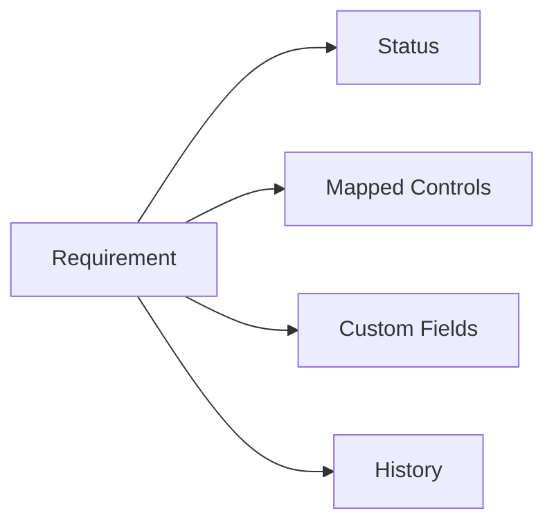

# Requirements

Requirements are the criteria within a framework that your organization must meet.

## Understanding Requirements

Each requirement represents a specific compliance obligation. Requirements are organized hierarchically within frameworks.

## Viewing Requirements

### Tree View

Browse requirements in their hierarchical structure:

- Expand/collapse categories
- See readiness status at each level
- Quick access to requirement details

### List View

View all requirements in a filterable table:

- Sort by any column
- Filter by status, category, or custom fields
- Bulk actions available

## Requirement Details

Click on any requirement to see its details:

| Section | Description |
|---------|-------------|
| **Overview** | Title, description, and guidance |
| **Controls** | Mapped controls with status |
| **Custom Fields** | Additional tracking fields |
| **History** | Change log and audit trail |
| **Comments** | Team discussions |

## Mapping Controls to Requirements

The core workflow in Gover is mapping controls to requirements.

### Add Control Mapping

1. Open a requirement
2. Click **Map Controls**
3. Choose from:
   - **Existing Controls** — Select from your control library
   - **Create New** — Create a control and map it
   - **AI Suggestions** — Get intelligent mapping recommendations

<!-- TODO: Add GIF showing control mapping -->

### AI-Assisted Mapping

Gover's AI can suggest relevant controls:

1. Click **AI Suggestions** in the mapping modal
2. Review suggested controls with confidence scores
3. Accept suggestions to create mappings
4. Modify or reject as needed

:::info
AI suggestions are based on requirement text, existing mappings, and industry best practices.
:::

## Requirement Status

Requirements show their compliance status:

| Status | Meaning |
|--------|---------|
| 🔴 **Not Started** | No controls mapped |
| 🟡 **In Progress** | Some controls mapped, not complete |
| 🟢 **Compliant** | All necessary controls in place |
| ⚪ **Not Applicable** | Marked as N/A for your organization |

## Filtering Requirements

Use filters to find specific requirements:

- **Status** — Filter by compliance status
- **Category** — Filter by framework section
- **Search** — Full-text search in titles and descriptions
- **Custom Fields** — Filter by custom field values

## Bulk Actions

Select multiple requirements:

- Export to CSV/Excel
- Bulk update custom fields
- Generate reports

## Best Practices

1. **Work systematically** — Address requirements section by section
2. **Use AI suggestions** — Let AI help identify relevant controls
3. **Document rationale** — Add comments explaining mapping decisions
4. **Review regularly** — Requirements may need re-evaluation as controls change

## Next Steps

- [Readiness Tracking](./readiness-tracking) — Monitor overall readiness
- [Controls Overview](../controls/overview) — Learn about control management
