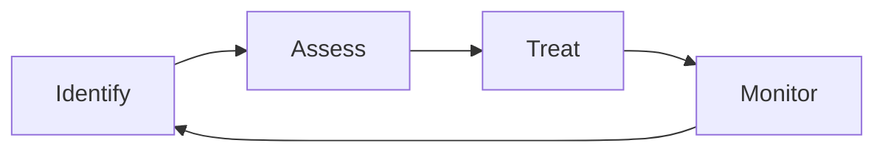
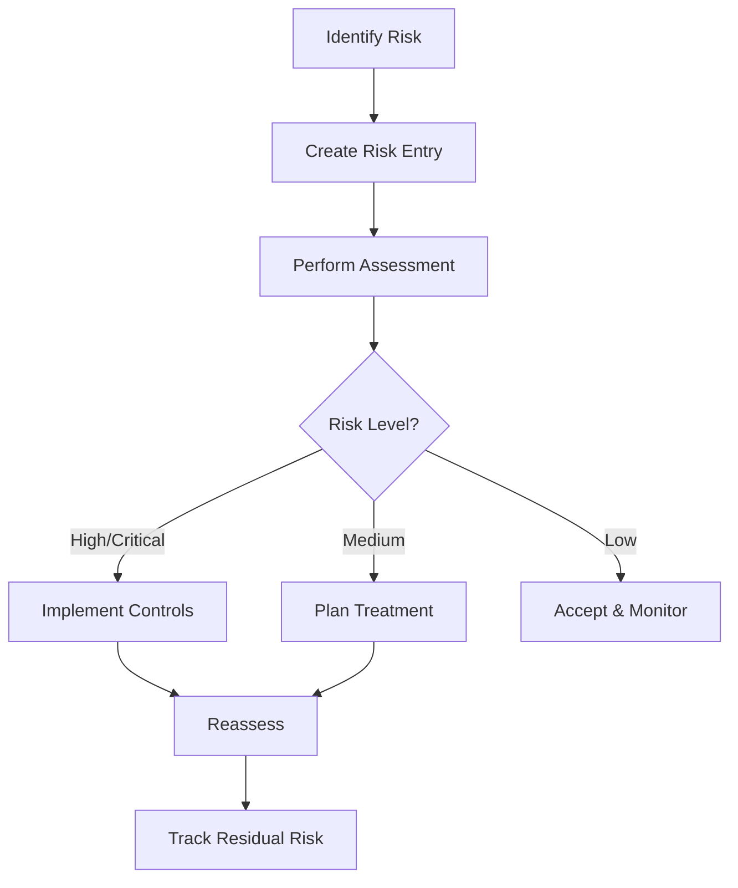

# Risk Management Overview

Gover provides comprehensive risk management capabilities to identify, assess, and treat organizational risks.

## What is Risk Management?

Risk management is the process of:
1. **Identifying** potential threats and vulnerabilities
2. **Assessing** their likelihood and impact
3. **Treating** risks through controls and other measures
4. **Monitoring** risk levels over time

## Risk Management in Gover

### Risk Register
Central repository of all identified risks with:
- Risk descriptions
- Categories and tags
- Ownership
- Treatment status

### Risk Assessments
Evaluate risks using:
- Customizable scoring fields
- Impact and likelihood ratings
- Calculated risk scores
- Risk level mappings

### Risk Treatment
Address risks through:
- Mitigation (implement controls)
- Acceptance (acknowledge and monitor)
- Transfer (insurance, outsourcing)
- Avoidance (eliminate the risk source)

## Key Concepts

| Concept | Description |
|---------|-------------|
| **Inherent Risk** | Risk level before any controls |
| **Residual Risk** | Risk level after controls are applied |
| **Risk Appetite** | Level of risk the organization accepts |
| **Risk Score** | Calculated value based on assessment fields |
| **Risk Level** | Category (Critical, High, Medium, Low) |

## Risk Views

### List View
All risks in a filterable, sortable table.

### Heatmap
Visual representation of risks by impact and likelihood.

### Overview Dashboard
Summary metrics and trends.

## Risk Workflow

## Next Steps

- [Risk Register](./risk-register) — Managing your risks
- [Risk Assessments](./risk-assessments) — Evaluating risks
- [Risk Treatment](./risk-treatment) — Addressing risks
- [Heatmap](./heatmap) — Visualizing risks
