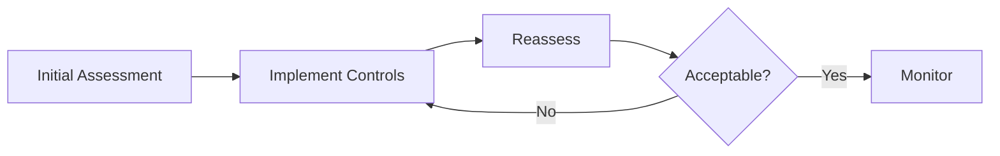

# Risk Assessments

Risk assessments evaluate the likelihood and impact of identified risks.

## What is a Risk Assessment?

A risk assessment is a structured evaluation that determines:
- How likely is the risk to occur?
- What would be the impact if it occurred?
- What is the overall risk score?
- What risk level does this represent?

## Assessment Types

### Inherent Risk Assessment
Evaluates risk **before** any controls are applied.
- Represents the "raw" risk level
- Baseline for measuring control effectiveness

### Residual Risk Assessment
Evaluates risk **after** controls are applied.
- Shows current risk exposure
- Guides further treatment decisions

## Performing an Assessment

1. Open a risk
2. Go to **Assessments** tab
3. Click **New Assessment**
4. Select assessment type (Inherent/Residual)
5. Complete the assessment form
6. Save

<!-- TODO: Add GIF showing assessment process -->

## Assessment Fields

Gover uses customizable assessment fields:

### Default Fields

| Field | Description | Scale |
|-------|-------------|-------|
| **Likelihood** | Probability of occurrence | 1-5 |
| **Impact** | Severity if it occurs | 1-5 |

### Custom Fields

Add custom fields for your methodology:
- Financial impact
- Reputational impact
- Operational impact
- Recovery time
- Detection capability

## Risk Score Calculation

Risk scores are calculated using formulas:

### Simple Formula
```
Risk Score = Likelihood × Impact
```

### Custom Formulas
Create complex formulas using:
- Multiple fields
- Weighted calculations
- Custom operators

Example:
```
Score = (Likelihood × 0.4) + (Impact × 0.6)
```

## Risk Levels

Scores map to risk levels:

| Score Range | Level | Color |
|-------------|-------|-------|
| 20-25 | Critical | 🔴 Red |
| 15-19 | High | 🟠 Orange |
| 10-14 | Medium | 🟡 Yellow |
| 5-9 | Low | 🟢 Green |
| 1-4 | Very Low | 🔵 Blue |

:::info
Risk level mappings are configurable in **Risks** → **Settings** → **Formulas**.
:::

## Assessment History

Track assessments over time:
- View all past assessments
- See score trends
- Compare inherent vs residual
- Identify improving/worsening risks



## Best Practices

1. **Be consistent** — Use the same criteria across assessments
2. **Document rationale** — Explain your scoring decisions
3. **Reassess regularly** — Risk levels change over time
4. **Compare inherent/residual** — Measure control effectiveness
5. **Involve stakeholders** — Get input from risk owners

## Next Steps

- [Risk Treatment](./risk-treatment) — Address assessed risks
- [Heatmap](./heatmap) — Visualize risk distribution
- [Formulas](./formulas) — Configure scoring formulas
