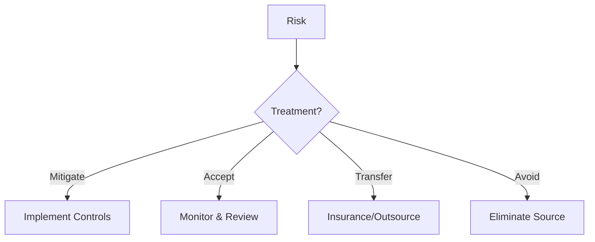

# Risk Treatment

Risk treatment is the process of addressing identified risks to reduce them to acceptable levels.

## Treatment Options



### Mitigate
Implement controls to reduce likelihood or impact.
- Most common treatment
- Links to control library
- Reduces residual risk

### Accept
Acknowledge the risk and monitor it.
- For low-level risks
- Within risk appetite
- Requires documentation

### Transfer
Shift risk to a third party.
- Insurance policies
- Outsourcing
- Contractual arrangements

### Avoid
Eliminate the risk source entirely.
- Stop the risky activity
- Change business process
- Most drastic option

## Setting Treatment

1. Open a risk
2. Go to **Overview** tab
3. Select **Treatment** type
4. Document the treatment plan
5. Save

## Treatment Plans

For each treatment, document:

| Element | Description |
|---------|-------------|
| **Treatment Type** | Mitigate, Accept, Transfer, Avoid |
| **Description** | How the risk will be treated |
| **Controls** | Linked controls (for mitigation) |
| **Owner** | Person responsible |
| **Target Date** | When treatment should be complete |
| **Status** | Progress of treatment |

## Linking Controls

For mitigation treatment:

1. Open the risk
2. Go to **Controls** tab
3. Click **Map Controls**
4. Select controls that address this risk
5. Confirm mapping

This shows:
- Which controls mitigate the risk
- Expected risk reduction
- Gaps in coverage

## Residual Risk

After treatment, assess residual risk:

1. Implement planned controls
2. Perform residual risk assessment
3. Compare to inherent risk
4. Verify risk is within appetite

### Residual Risk Formula
```
Residual Risk = Inherent Risk - Control Effectiveness
```

## Treatment Tasks

Create tasks to track treatment:

1. Open the risk
2. Go to **Tasks** tab
3. Click **Create Task**
4. Define:
   - Task title
   - Assignee
   - Due date
   - Description
5. Track to completion

## Treatment Status

| Status | Description |
|--------|-------------|
| **Planned** | Treatment identified, not started |
| **In Progress** | Treatment being implemented |
| **Completed** | Treatment fully implemented |
| **Verified** | Effectiveness confirmed |

## Monitoring

After treatment:
- Schedule periodic reviews
- Reassess risk levels
- Update treatment as needed
- Document changes

## Best Practices

1. **Match treatment to risk** — High risks need strong treatment
2. **Document decisions** — Explain why you chose each treatment
3. **Set deadlines** — Treatment should have target dates
4. **Verify effectiveness** — Reassess after treatment
5. **Review regularly** — Treatments may need adjustment

## Next Steps

- [Heatmap](./heatmap) — Visualize risk distribution
- [Formulas](./formulas) — Configure risk scoring
