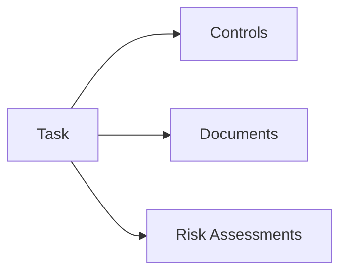
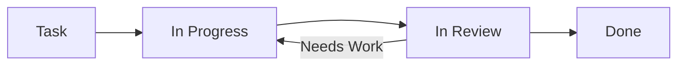

# Tasks

Tasks help you track compliance activities, assignments, and deadlines.

## What are Tasks?

Tasks represent work items in your compliance program:

- Control implementation
- Document reviews
- Risk assessments
- Audit preparations
- Remediation actions

## Task Views

### Kanban Board

Visual board with columns for each status:

- Drag and drop to change status
- See work in progress at a glance
- Identify bottlenecks

### List View

Traditional table view:

- Sort by any column
- Filter by multiple criteria
- Bulk actions

## Task Properties

| Property | Description |
|----------|-------------|
| **Title** | Task name |
| **Description** | Detailed instructions |
| **Assignee** | Person responsible |
| **Due Date** | Deadline |
| **Priority** | High, Medium, Low |
| **Status** | Current state |
| **Category** | Task type |

## Task Relationships

Tasks connect to:

## Task Workflow

## Key Actions

| Action | Description |
|--------|-------------|
| **Create** | Add new tasks |
| **Assign** | Assign to team members |
| **Update Status** | Move through workflow |
| **Link** | Connect to controls, documents |
| **Comment** | Discuss with team |

## Next Steps

- [Kanban Board](./kanban) — Visual task management
- [List View](./list-view) — Table-based task management
- [Task Statuses](./statuses) — Configure workflow
