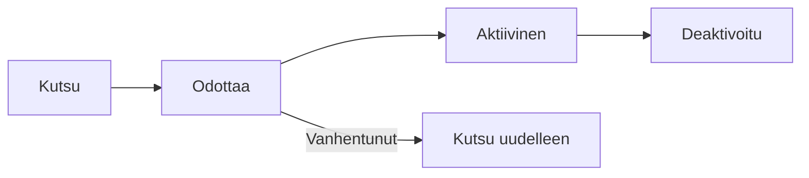

# Käyttäjähallinta

Hallitse käyttäjiä, rooleja ja käyttöoikeuksia koko organisaatiossasi.

## Käyttäjän elinkaari

## Käyttäjien kutsuminen

### Yksittäinen kutsu

1. Mene kohtaan **Organisaatioasetukset** → **Käyttäjät**
2. Klikkaa **Kutsu käyttäjä**
3. Syötä:
   - Sähköpostiosoite
   - Organisaatiorooli
   - Työtilaoikeudet
4. Klikkaa **Lähetä kutsu**

### Massakutsu

1. Klikkaa **Massakutsu**
2. Lataa CSV-tiedosto sähköposteilla
3. Aseta oletusrooli
4. Lähetä kutsut

## Käyttäjäroolit

### Organisaatioroolit

| Rooli         | Kuvaus                       |
| ------------- | ---------------------------- |
| **Org Admin** | Täysi organisaation hallinta |
| **Jäsen**     | Normaali organisaation jäsen |

### Työtilaroolit

| Rooli          | Ominaisuudet                              |
| -------------- | ----------------------------------------- |
| **Ylläpitäjä** | Täysi työtilan hallinta, pääsy asetuksiin |
| **Muokkaaja**  | Luo, muokkaa ja poistaa kaikkea sisältöä  |
| **Avustaja**   | Luo ja muokkaa nimettyä sisältöä          |
| **Lukija**     | Vain lukuoikeus                           |

## Oikeusmatriisi

| Toiminto            | Admin | Editor | Contributor | Viewer |
| ------------------- | ----- | ------ | ----------- | ------ |
| Tarkastele sisältöä | ✅    | ✅     | ✅          | ✅     |
| Luo sisältöä        | ✅    | ✅     | ✅          | ❌     |
| Muokkaa kaikkea     | ✅    | ✅     | ❌          | ❌     |
| Muokkaa nimettyä    | ✅    | ✅     | ✅          | ❌     |
| Poista sisältöä     | ✅    | ✅     | ❌          | ❌     |
| Hallitse asetuksia  | ✅    | ❌     | ❌          | ❌     |
| Hallitse käyttäjiä  | ✅    | ❌     | ❌          | ❌     |

## Työtilaoikeuksien hallinta

### Oikeuksien myöntäminen

1. Avaa työtilan asetukset
2. Mene kohtaan **Käyttäjät**
3. Klikkaa **Lisää käyttäjä**
4. Valitse käyttäjä ja rooli
5. Tallenna

### Oikeuksien muokkaaminen

1. Klikkaa käyttäjää
2. Muuta roolia
3. Tallenna

### Oikeuksien poistaminen

1. Valitse käyttäjä
2. Klikkaa **Poista oikeudet**
3. Vahvista

## Käyttäjän tila

| Tila            | Merkitys                                          |
| --------------- | ------------------------------------------------- |
| **Aktiivinen**  | Käyttäjä voi kirjautua sisään ja käyttää palvelua |
| **Odottaa**     | Kutsu lähetetty, ei vielä hyväksytty              |
| **Deaktivoitu** | Pääsy estetty väliaikaisesti                      |

## Käyttäjien deaktivointi

Kun joku lähtee organisaatiosta:

1. Mene kohtaan **Käyttäjät**
2. Valitse käyttäjä
3. Klikkaa **Deaktivoi**
4. Käyttäjä menettää pääsyn, mutta tiedot säilyvät

## Tarkastuspolku

Seuraa käyttäjien toimia:

- Kirjautumishistoria
- Sisältömuutokset
- Oikeusmuutokset

Pääsy kohdasta **Organisaatioasetukset** → **Tarkastusloki**

## Parhaat käytännöt

1. **Vähimmän oikeuden periaate** — Anna vain välttämättömät oikeudet
2. **Säännöllinen tarkistus** — Tarkasta käyttäjäoikeudet säännöllisesti
3. **Nopea deaktivointi** — Poista oikeudet heti kun henkilö lähtee
4. **Dokumentoi roolit** — Määrittele mitä kukin rooli saa tehdä
5. **Käytä työtilarooleja** — Älä tee kaikista organisaation ylläpitäjiä

## Seuraavat vaiheet

- [Sisältöhubi](./content-hub) — Mallipohjat ja markkinapaikka
- [Organisaatioasetukset](./organization-settings) — Paluu organisaatioasetuksiin
