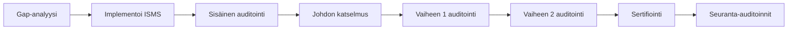

# ISO 27001 -vaatimustenmukaisuus Goverilla

ISO 27001 on kansainvälinen standardi tietoturvallisuuden hallintajärjestelmille (ISMS).

## Yleiskatsaus

| Ominaisuus       | Arvo                                 |
| ---------------- | ------------------------------------ |
| **Koko nimi**    | ISO/IEC 27001:2022                   |
| **Tyyppi**       | Kansainvälinen standardi             |
| **Julkaisija**   | ISO/IEC                              |
| **Sertifiointi** | Saatavilla akkreditoiduilta tahoilta |

## Rakenne

### Pääkohdat (4-10)

- Organisaation toimintaympäristö
- Johtajuus
- Suunnittelu
- Tukitoiminnot
- Toiminta
- Suorituskyvyn arviointi
- Parantaminen

### Liite A:n hallintakeinot (Annex A Controls)

93 hallintakeinoa jaettu 4 teemaan:

- Organisaatioon liittyvät hallintakeinot (37)
- Henkilöstöön liittyvät hallintakeinot (8)
- Fyysiset hallintakeinot (14)
- Teknologiset hallintakeinot (34)

## Keskeiset vaatimukset

### ISMS-vaatimukset

- Määrittele soveltamisala
- Luo tietoturvapolitiikka
- Riskinarviointi
- Riskien käsittely
- Soveltuvuuslausunto (Statement of Applicability)
- Jatkuva parantaminen

### Liite A:n hallintakeinoalueet

| Alue                 | Hallintakeinot                              |
| -------------------- | --------------------------------------- |
| **A.5 Organisaatio** | Politiikat, roolit, vastuut             |
| **A.6 Henkilöstö**   | Taustaselvitykset, tietoisuus, koulutus |
| **A.7 Fyysinen**     | Turva-alueet, laitteet, utiliteetit     |
| **A.8 Teknologinen** | Pääsynhallinta, salaus, operaatiot      |

## Goverin käyttö ISO 27001:lle

### 1. Lisää viitekehys

1. Mene kohtaan **Viitekehykset** → **Lisää viitekehys**
2. Valitse mallipohjista **ISO 27001:2022**
3. Lisää työtilaasi

### 2. Määritä soveltamisala

Dokumentoi ISMS-soveltamisalasi:

- Organisaation rajat
- Tietovarannot
- Sijainnit
- Teknologiat

### 3. Suorita riskinarviointi

Käytä Goverin riskienhallintaa:

1. Tunnista tietoturvariskit
2. Arvioi todennäköisyys ja vaikutus
3. Määritä riskitasot
4. Suunnittele käsittelytoimenpiteet

### 4. Luo soveltuvuuslausunto (SoA)

Yhdistä hallintakeinot vaatimuksiin:

- Merkitse soveltuvat hallintakeinot
- Dokumentoi perustelut poissulkemisille
- Linkitä implementoituihin hallintakeinoihin

### 5. Ota hallintakeinot käyttöön

Jokaiselle Liite A:n hallintakeinolle:

1. Luo tai yhdistä olemassa olevat hallintakeinot
2. Linkitä todisteasiakirjat
3. Määritä omistajat
4. Seuraa toteutusta

## Sertifiointipolku

## Suositeltu lähestymistapa

1. **Gap-analyysi** — Arvioi nykytila suhteessa ISO 27001:een
2. **Riskinarviointi** — Tunnista ja arvioi riskit
3. **Hallintakeinoen implementointi** — Korjaa puutteet
4. **Dokumentaatio** — Luo vaaditut asiakirjat
5. **Sisäinen auditointi** — Varmista vaatimustenmukaisuus
6. **Sertifiointiauditointi** — Ulkoinen arviointi

## Keskeiset asiakirjat

| Asiakirja                         | Tarkoitus                   |
| --------------------------------- | --------------------------- |
| **ISMS-politiikka**               | Ylätason tietoturvasitoumus |
| **Riskinarviointi**               | Dokumentoitu riskianalyysi  |
| **Soveltuvuuslausunto (SoA)**     | Hallintakeinoen soveltuvuus     |
| **Riskien käsittelysuunnitelma**  | Miten riskeihin vastataan   |
| **Sisäisen auditoinnin raportit** | Auditointihavainnot         |

## Resurssit

- [ISO 27001 Standardi](https://www.iso.org/standard/27001)
- [ISO 27002 Ohjeistus](https://www.iso.org/standard/75652.html)

## Seuraavat vaiheet

- [Riskienhallinta](../user-guide/risks/overview) — Implementoi riskiprosessit
- [Hallintakeinot](../user-guide/controls/overview) — Hallitse hallintakeinojasi
