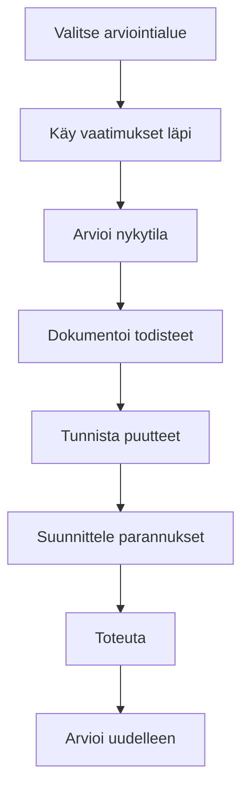

# Kybermittari Goverilla

Kybermittari on Suomen kansallinen kyberturvallisuuden arviointityökalu.

## Yleiskatsaus

| Ominaisuus         | Arvo                               |
| ------------------ | ---------------------------------- |
| **Koko nimi**      | Kybermittari                       |
| **Lainkäyttöalue** | Suomi                              |
| **Julkaisija**     | Traficom / Kyberturvallisuuskeskus |
| **Tyyppi**         | Itsearviointityökalu               |

## Tarkoitus

Kybermittari auttaa suomalaisia organisaatioita:

- Arvioimaan kyberturvallisuuden kypsyystasoa
- Tunnistamaan kehityskohteet
- Vertailemaan parhaisiin käytäntöihin
- Täyttämään sääntelyodotukset

## Rakenne

### Arviointialueet

| Alue                     | Fokus                                         |
| ------------------------ | --------------------------------------------- |
| **Hallinto**             | Johtaminen, politiikat, organisaatio          |
| **Riskienhallinta**      | Riskien tunnistaminen ja käsittely            |
| **Omaisuudenhallinta**   | Inventaario, luokittelu                       |
| **Pääsynhallinta**       | Identiteetinhallinta ja pääsyoikeudet         |
| **Toiminta**             | Tietoturvaoperaatiot, valvonta                |
| **Häiriönhallinta**      | Havainnointi, reagointi, palautuminen         |
| **Jatkuvuus**            | Liiketoiminnan jatkuvuus, toipumissuunnittelu |
| **Vaatimustenmukaisuus** | Laki- ja sääntelyvaatimukset                  |

### Kypsyystasot

| Taso               | Kuvaus                    |
| ------------------ | ------------------------- |
| **1 - Alustava**   | Ad hoc, reaktiivinen      |
| **2 - Kehittyvä**  | Perusprosessit määritelty |
| **3 - Määritelty** | Standardoidut prosessit   |
| **4 - Hallittu**   | Mitattu ja kontrolloitu   |
| **5 - Optimoiva**  | Jatkuva parantaminen      |

## Goverin käyttö Kybermittariin

### 1. Lisää viitekehys

1. Mene kohtaan **Viitekehykset** → **Lisää viitekehys**
2. Valitse mallipohjista **Kybermittari**
3. Lisää työtilaasi

### 2. Suorita itsearviointi

Jokaiselle vaatimukselle:

1. Käy vaatimus läpi
2. Arvioi nykyinen kypsyystasosi
3. Dokumentoi todisteet
4. Tunnista puutteet

### 3. Yhdistä kontrollit

Linkitä olemassa olevat kontrollisi Kybermittarin vaatimuksiin:

- Tietoturvapolitiikat
- Tekniset kontrollit
- Prosessit ja toimintatavat

### 4. Seuraa kehitystä

Käytä Goveria:

- Kypsyystason kehityksen seurantaan
- Kehityshankkeiden suunnitteluun
- Toteutuksen seurantaan

## Arviointiprosessi

## Yhteensopivuus muiden viitekehysten kanssa

Kybermittari on linjassa seuraavien kanssa:

- **ISO 27001** — Tietoturvallisuus
- **NIS2** — EU:n kyberturvallisuusdirektiivi
- **NIST CSF** — Kyberturvallisuusviitekehys

## Resurssit

- [Traficom Kybermittari](https://www.kyberturvallisuuskeskus.fi/fi/palvelumme/tilannekuva-ja-verkostojohtaminen/kybermittari)
- [Kyberturvallisuuskeskus](https://www.kyberturvallisuuskeskus.fi/)

## Seuraavat vaiheet

- [NIS2](./nis2) — Liittyvä EU-direktiivi
- [ISO 27001](./iso-27001) — Kansainvälinen tietoturvastandardi
