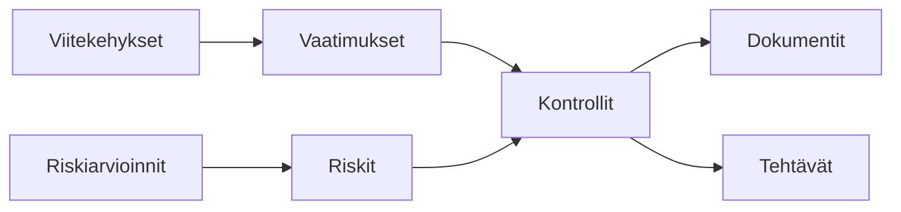

# Johdanto Goveriin

Tervetuloa **Goveriin** — moderniin hallinto-, riski- ja vaatimustenmukaisuuden (GRC) hallintajärjestelmään.

Gover auttaa organisaatioita hallitsemaan vaatimustenmukaisuuskehyksiä, seuraamaan riskejä, toteuttamaan kontrolleja ja ylläpitämään dokumentaatiota yhdessä yhtenäisessä työtilassa.

## Mikä on Gover?

Gover on kattava GRC-alusta, joka on suunniteltu yksinkertaistamaan vaatimustenmukaisuuden hallintaa kaikenkokoisille organisaatioille. Olipa tavoitteenasi ISO 27001 -sertifiointi, GDPR-vaatimustenmukaisuus tai useiden viitekehysten samanaikainen hallinta, Gover tarjoaa tarvitsemasi työkalut.

## Keskeiset ominaisuudet

| Ominaisuus | Kuvaus |
|------------|--------|
| **Viitekehysten hallinta** | Tuo ja hallitse viitekehyksiä kuten ISO 27001, GDPR, NIS2 |
| **Kontrollikirjasto** | Luo, järjestä ja yhdistä kontrollit vaatimuksiin |
| **Riskienhallinta** | Tunnista, arvioi ja käsittele riskejä mukautettavalla pistetyksellä |
| **Dokumenttien hallinta** | Lataa, luo ja linkitä todisteita |
| **Tehtävien hallinta** | Seuraa tehtäviä Kanban- ja listanäkymillä |
| **AI-avustaja** | Saa älykkäitä ehdotuksia yhdistämisiin ja vaatimustenmukaisuuteen |

## Kenelle Gover on tarkoitettu?

- **Vaatimustenmukaisuuspäälliköt** — Hallitse viitekehyksiä ja seuraa valmiutta
- **Riskipäälliköt** — Arvioi ja seuraa organisaation riskejä
- **IT-tietoturvatiimit** — Toteuta ja dokumentoi tietoturvakontrollit
- **Auditoijat** — Tarkista vaatimustenmukaisuuden tila ja todisteet
- **Johto** — Saa näkyvyys vaatimustenmukaisuuden tilaan

## Avun saaminen

- 📧 Sähköposti: [info@gover.io](mailto:info@gover.io)
- 🌐 Verkkosivusto: [gover.io](https://gover.io)
- 📱 Sovellus: [app.gover.io](https://app.gover.io)

Oletko valmis aloittamaan? Jatka [Pikaoppaaseen](./quick-start).
