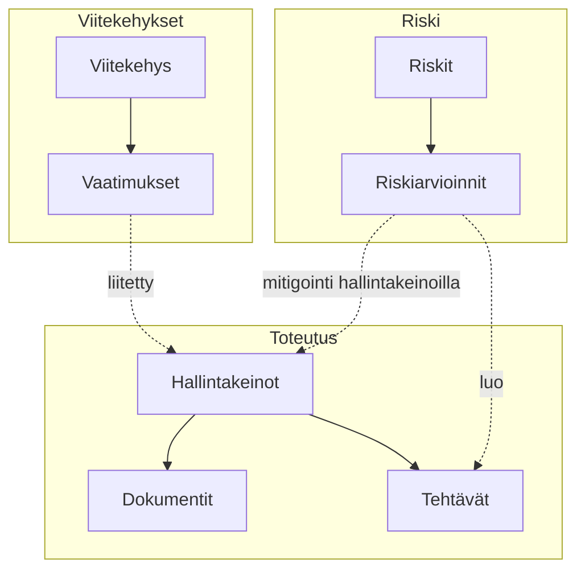

# Peruskäsitteet

Näiden ydinkäsitteiden ymmärtäminen auttaa sinua saamaan parhaan hyödyn Goverista.

## GRC-hierarkia

## Viitekehykset

**Viitekehys** on jäsennelty joukko vaatimuksia, jotka määrittelevät vaatimustenmukaisuusstandardit. Esimerkkejä:

- **ISO 27001** — Tietoturvan hallintajärjestelmä
- **GDPR** — Tietosuoja-asetus
- **NIS2** — Verkko- ja tietoturvadirektiivi
- **SOC 2** — Palveluorganisaation hallintakeinot

Viitekehykset sisältävät **vaatimuksia**, jotka on järjestetty hierarkkiseen rakenteeseen (luvut, osiot, artiklat).

## Vaatimukset

**Vaatimukset** ovat viitekehyksen yksittäisiä vaatimustenmukaisuuskriteerejä. Jokainen vaatimus:

- Sisältää yksilöllisen tunnisteen (esim. "A.5.1.1")
- Sisältää kuvauksen ja ohjeistuksen
- Voidaan yhdistää yhteen tai useampaan hallintakeinoin
- Näyttää valmiustilan liitettyjen hallintakeinoen perusteella

## Hallintakeinot

**Hallintakeinot** ovat toimenpiteitä, käytäntöjä tai menettelyjä, joita toteutat vaatimusten täyttämiseksi. Hallintakeino voi:

- Yhdistyä useisiin vaatimuksiin eri viitekehyksissä
- Linkittyä todistedokumentteihin
- Sisältää liittyviä tehtäviä
- Olla luokiteltu ja merkitty tunnisteilla

:::info Hallintakeinoen uudelleenkäyttö
Yksi hallintakeino voi täyttää vaatimuksia useista viitekehyksistä. Esimerkiksi "Pääsynhallintakäytäntö" voi täyttää vaatimuksia sekä ISO 27001:ssä että GDPR:ssä.
:::

## Riskit

**Riskit** edustavat mahdollisia uhkia organisaatiollesi. Jokaisella riskillä on:

- **Luontainen riski** — Riskitaso ennen hallintakeinoja
- **Jäännösriski** — Riskitaso hallintakeinoen soveltamisen jälkeen
- **Käsittelysuunnitelma** — Miten riskiä käsitellään (lieventäminen, hyväksyminen, siirtäminen, välttäminen)

Riskinarvioinnit ohjaavat mitigointia, ja mitigointi toteutetaan hallintakeinoilla.

## Riskiarvioinnit

**Riskiarvioinnit** arvioivat yksittäisiä riskejä mukautettavilla pisteytyskenttillä:

- Vaikutus- ja todennäköisyyspisteet
- Mukautetut arviointikentät
- Lasketut riskipisteet kaavoilla
- Riskitasomääritykset (Kriittinen, Korkea, Keskitaso, Matala)

## Dokumentit

**Dokumentit** toimivat todisteina hallintakeinoillesi. Ne voivat olla:

- Politiikkoja ja menettelyjä
- Todistetietueita
- Auditointiraportteja
- Sopimuksia ja sopimusasiakirjoja
- Ladattuja tiedostoja (PDF, Word jne.)
- Suoraan Goverissa luotuja

## Tehtävät

**Tehtävät** seuraavat vaatimustenmukaisuustoimintoja:

- Osoitettu tiimin jäsenille
- Sisältävät määräajat ja prioriteetit
- Voidaan linkittää hallintakeinoihin, riskeihin tai dokumentteihin
- Hallitaan Kanban-taululla tai listanäkymässä

## Yhdistämiset

**Yhdistämiset** ovat yhteyksiä entiteettien välillä:

| Mistä | Mihin | Tarkoitus |
|-------|-------|-----------|
| Vaatimus | Hallintakeino | Näyttää miten vaatimukset täytetään |
| Hallintakeino | Dokumentti | Linkittää todisteet hallintakeinoihin |
| Hallintakeino | Riski | Näyttää mitkä hallintakeinot lieventävät riskejä |
| Hallintakeino | Tehtävä | Seuraa toteutustyötä |

## Työtilat ja organisaatiot

- **Organisaatio** — Yrityksesi tai yhteisösi Goverissa
- **Työtila** — Erillinen ympäristö organisaation sisällä

Käyttäjillä voi olla eri rooleja ja oikeuksia eri työtiloissa.

## Sisältökeskus

**Sisältökeskuksessa** on tällä hetkellä:

- **Löydä** — Yhteisön markkinapaikka
- **Asennetut** — Työtilaasi lisätty sisältö

**Mallit** ja **Oma sisältö** tulevat myöhemmin, jotta voit julkaista omaa sisältöä.
