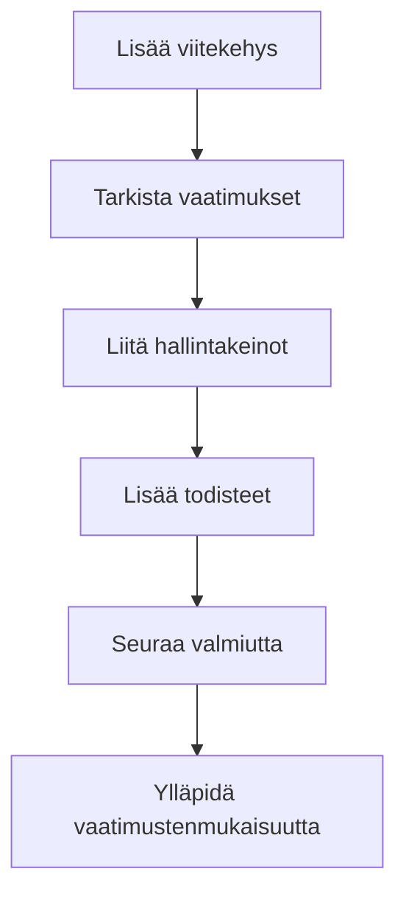

# Pikaopas

Pääset alkuun Goverilla muutamassa minuutissa.

## Vaihe 1: Kirjaudu sisään

1. Siirry osoitteeseen [app.gover.io](https://app.gover.io)
2. Kirjaudu organisaatiosi SSO:lla (Microsoft tai sähköposti, Google tulossa)
3. Suorita MFA-vahvistus tarvittaessa

## Vaihe 2: Valitse työtilasi

Kirjautumisen jälkeen näet käytettävissä olevat työtilat. Jokainen työtila on erillinen ympäristö vaatimustenmukaisuuden hallintaan.

- **Valitse olemassa oleva työtila** jatkaaksesi työskentelyä
- **Luo uusi työtila** jos aloitat alusta

:::tip Vinkki
Työtilat sopivat erinomaisesti eri liiketoimintayksiköiden, projektien tai asiakkaiden erottamiseen.
:::

## Vaihe 3: Lisää ensimmäinen viitekehys

1. Siirry kohtaan **Viitekehykset** sivupalkissa
2. Avaa **Mallipohjat**-välilehti **Viitekehykset**-näkymässä
3. Valitse mallipohja (ISO 27001, GDPR, NIS2 jne.) ja klikkaa **Lisää työtilaan**
4. Löytääksesi lisää mallipohjia, siirry kohtaan **Organisaatioasetukset** → **Sisältöhubi** ja asenna mallipohjia työtilaasi

## Vaihe 4: Tarkista vaatimukset

Kun viitekehys on lisätty:

1. Klikkaa viitekehystä avataksesi sen
2. Näet välilehdet **Yleiskatsaus** ja **Vaatimukset**
3. Avaa **Vaatimukset** ja selaa kategorioihin ryhmiteltyjä vaatimuksia
4. Voit piilottaa **Puunäkymän** ja käyttää **Luettelonäkymää** tarpeen mukaan
5. Jokainen vaatimus näyttää vaatimustenmukaisuuden tilan

## Vaihe 5: Liitä hallintakeinot

Hallintakeinot ovat toimenpiteitä, joita toteutat vaatimusten täyttämiseksi.

1. Avaa vaatimus
2. Klikkaa **Liitä hallintakeinot**
3. Valitse olemassa olevia hallintakeinoja tai luo uusia
4. Vaatimuksen valmius päivittyy automaattisesti

## Vaihe 6: Seuraa edistymistä

Käytä **Etusivu**-kojelautaa seurataksesi:

- Kokonaisvaatimustenmukaisuuden valmiutta
- Odottavia tehtäviä
- Viimeaikaista toimintaa
- Riskikatsausta

## Seuraavat vaiheet

- [Peruskäsitteet](./key-concepts) — Ymmärrä Goverin ydinkäsitteet
- [Viitekehysopas](../user-guide/frameworks/overview) — Syvenny viitekehysten hallintaan
- [Hallintakeinoopas](../user-guide/controls/overview) — Opi hallintakeinoen hallinnasta
