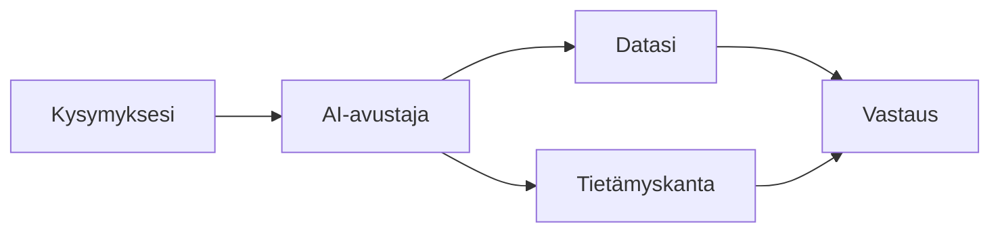

# AI-avustaja

Goverin AI-avustaja auttaa sinua työskentelemään älykkäämmin älykkäiden ehdotusten ja automaation avulla.

## Mitä AI voi tehdä?

AI-avustaja auttaa:

| Kyvykkyys                | Kuvaus                                   |
| ------------------------ | ---------------------------------------- |
| **Yhdistämisehdotukset** | Suosittele kontrolli-vaatimus -yhteyksiä |
| **Dokumenttianalyysi**   | Ehdota dokumentti-kontrolli -linkkejä    |
| **Chat-käyttöliittymä**  | Vastaa kysymyksiin datastasi             |
| **Sisällöntuotanto**     | Auta kuvausten ja sisällön luonnissa     |

## AI-ominaisuudet

### Chat-avustaja

Keskustelupohjainen käyttöliittymä:

- Kysy kysymyksiä vaatimustenmukaisuusdatastasi
- Saa ohjausta vaatimustenmukaisuusaiheista
- Navigoi relevantteihin kohteisiin

### Älykkäät ehdotukset

Automatisoidut suositukset:

- Kontrolliyhteydet vaatimuksiin
- Dokumenttiyhteydet kontrolleihin
- Riskien käsittelyvaihtoehdot

### Sisältöapu

Apua kirjoittamiseen:

- Kontrollikuvaukset
- Riskikuvaukset
- Dokumenttisisältö

## Miten se toimii

AI:

1. Analysoi kysymyksesi tai kontekstin
2. Tarkistaa työtilasi datan
3. Soveltaa vaatimustenmukaisuustietämystä
4. Tarjoaa relevantteja ehdotuksia

## Tietosuoja ja turvallisuus

:::info Tietosuoja

- AI toimii Azure OpenAI:ssa EU:ssa (Sweden Central)
- Dataasi ei käytetä koulutukseen
- Prompteja ei tallenneta, ellei sisältöä tallenneta
- Yritystason tietoturva
  :::

## Aloittaminen

1. Klikkaa **AI-avustaja** -kuvaketta sivupalkissa
2. Aloita keskustelu tai pyydä ehdotuksia
3. Tarkista ja sovella suosituksia

## Seuraavat vaiheet

- [Chat-käyttöliittymä](./chat) — Chat-avustajan käyttö
- [AI-ehdotukset](./suggestions) — Suositusten käyttö
- [Parhaat käytännöt](./best-practices) — Hyödynnä AI:ta parhaiten
