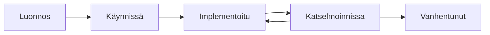

# Hallintakeinoen luominen

Opi, kuinka lisäät hallintakeinoja Gover-työtilaasi.

## Tavat luoda hallintakeinoja

### 1. Manuaalinen luonti

Luo hallintakeinoja yksi kerrallaan:

1. Siirry kohtaan **Hallintakeinot** → **Lisää hallintakeino**
2. Täytä hallintakeinon tiedot:
   - **Otsikko** — Selkeä, kuvaava nimi
   - **Kuvaus** — Mitä hallintakeino tekee ja miten
   - **Kategoria** — Organisaation mukainen ryhmittely
   - **Omistaja** — Vastuuhenkilö
3. Klikkaa **Tallenna**

<!-- TODO: Add GIF showing control creation -->

### 2. Mallipohjista

Käytä valmiita hallintakeinomalleja:

1. Mene kohtaan **Hallintakeinot** → **Mallipohjat**
2. Selaa saatavilla olevia malleja kategorioittain
3. Klikkaa **Käytä mallipohjaa**
4. Mukauta tarpeen mukaan
5. Tallenna kirjastoosi

### 3. Sisältöhubista

Asenna hallintakeinoja markkinapaikalta:

1. Siirry kohtaan **Sisältöhubi** → **Discovery**
2. Etsi hallintakeinopaketteja
3. Klikkaa **Asenna**
4. Hallintakeinot lisätään kirjastoosi

### 4. Massatuonti

Tuo useita hallintakeinoja kerralla:

1. Mene kohtaan **Hallintakeinot** → **Tuo**
2. Lataa tuontimalli (template)
3. Täytä hallintakeinosi
4. Lataa tiedosto
5. Tarkista ja vahvista

#### Tuontimallin muoto

| Sarake        | Pakollinen | Kuvaus               |
| ------------- | ---------- | -------------------- |
| `title`       | Kyllä      | Hallintakeinon nimi      |
| `description` | Ei         | Hallintakeinon kuvaus    |
| `category`    | Ei         | Kategorian nimi      |
| `owner`       | Ei         | Omistajan sähköposti |

## Hallintakeinon tiedot

### Perustiedot

- **Otsikko** — Pidä ytimekkäänä mutta kuvaavana
- **Kuvaus** — Sisällytä:
  - Mitä hallintakeino tekee
  - Miten se on toteutettu
  - Odotetut tulokset

### Kategoriat

Järjestä hallintakeinot kategorioihin:

- Tietoturvahallintakeinot
- Tietosuojahallintakeinot
- Operatiiviset hallintakeinot
- Tekniset hallintakeinot
- Hallinnolliset hallintakeinot

:::tip
Luo kategoria-rakenne, joka vastaa organisaatiosi tarpeita.
:::

### Mukautetut kentät

Lisää mukautettuja kenttiä lisäseurantaa varten:

- Implementointipäivämäärä
- Katselmointitiheys
- Vaatimustenmukaisuuden laajuus
- Riskiluokitus

### Tunnisteet

Käytä tunnisteita joustavaan ryhmittelyyn:

- Läpileikkaavat aiheet
- Projektiyhteydet
- Prioriteettitasot

## Parhaat käytännöt

1. **Käytä selkeitä nimiä** — "Pääsynhallintapolitiikka" ei "PHP-001"
2. **Ole täsmällinen** — Kuvaa tarkalleen mitä hallintakeino tekee
3. **Määritä omistajat** — Jokaisella hallintakeinolla tulee olla vastuuhenkilö
4. **Kategorisoi johdonmukaisesti** — Käytä standardia kategoriarakennetta
5. **Linkitä todisteet** — Liitä tukidokumentit

## Hallintakeinon elinkaari

## Seuraavat vaiheet

- [Hallintakeinoen yhdistäminen](./mapping) — Linkitä hallintakeinot vaatimuksiin
- [Hallintakeinoen testaus](./testing) — Varmista tehokkuus
- [Kategoriat](./categories) — Järjestä hallintakeinosi
