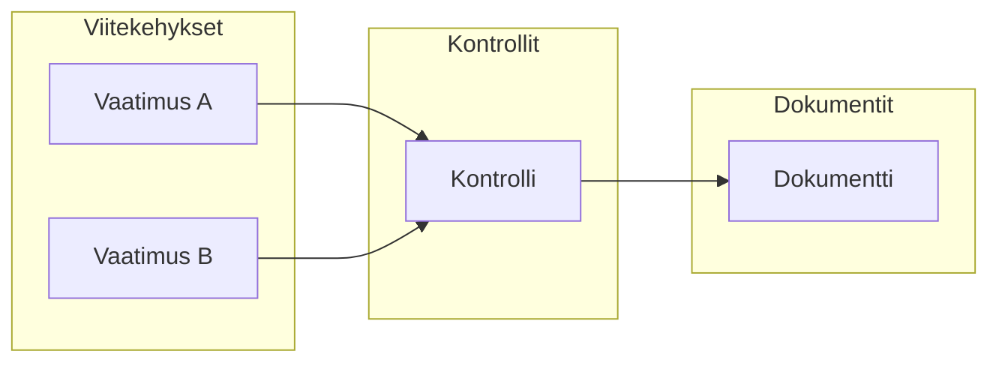

# Kontrollien yhdistäminen

Yhdistä kontrollit vaatimuksiin, riskeihin ja asiakirjoihin vaatimustenmukaisuuskuvasi rakentamiseksi.

## Miksi yhdistäminen on tärkeää?

Yhdistäminen luo yhteydet, jotka mahdollistavat Goverin vaatimustenmukaisuuden seurannan:

## Yhdistäminen vaatimuksiin

### Kontrollista

1. Avaa kontrolli
2. Mene **Vaatimukset** -välilehdelle
3. Klikkaa **Yhdistä vaatimukset**
4. Valitse vaatimukset mistä tahansa viitekehyksestä
5. Vahvista yhdistäminen

### Vaatimuksesta

1. Avaa vaatimus
2. Klikkaa **Yhdistä kontrollit**
3. Valitse olemassa olevat kontrollit tai luo uusi
4. Vahvista yhdistäminen

### AI-avusteinen yhdistäminen

Anna tekoälyn ehdottaa relevantteja yhteyksiä:

1. Avaa kontrolli tai vaatimus
2. Klikkaa **AI-ehdotukset**
3. Tarkista ehdotukset luottamuslukuineen
4. Hyväksy tai hylkää kukin ehdotus

:::info
AI analysoi tekstin samankaltaisuutta, olemassa olevia yhteyksiä ja alan malleja tehdäkseen ehdotuksia.
:::

## Yhdistäminen riskeihin

Linkitä kontrollit riskeihin, joita ne lieventävät:

1. Avaa kontrolli
2. Mene **Riskit** -välilehdelle
3. Klikkaa **Yhdistä riskit**
4. Valitse riskit rekisteristäsi
5. Vahvista yhdistäminen

Tämä näyttää:

- Mitkä riskit lievennetään kontrolleilla
- Kontrollikattavuuden riskien käsittelyssä
- Puutteet riskien lieventämisessä

## Yhdistäminen dokumentteihin

Liitä todistedokumentteja kontrolleihin:

1. Avaa kontrolli
2. Mene **Dokumentit** -välilehdelle
3. Klikkaa **Yhdistä dokumentit**
4. Valitse olemassa olevat dokumentit tai lataa uusi
5. Vahvista yhdistäminen

### Dokumenttityypit

| Tyyppi         | Tarkoitus                        |
| -------------- | -------------------------------- |
| **Politiikat** | Muodolliset politiikkadokumentit |
| **Menettelyt** | Vaiheittaiset prosessit          |
| **Tietueet**   | Todisteet toteutuksesta          |
| **Raportit**   | Auditointi- ja arviointiraportit |

## Yhdistäminen tehtäviin

Linkitä implementointi- ja katselmointitehtävät:

1. Avaa kontrolli
2. Mene **Tehtävät** -välilehdelle
3. Klikkaa **Yhdistä tehtävät** tai **Luo tehtävä**
4. Liitä relevantit tehtävät

## Yhteyksien tarkastelu

### Kontrollinäkymä

Näe kaikki yhden kontrollin yhteydet:

- Vaatimukset-välilehti
- Riskit-välilehti
- Dokumentit-välilehti
- Tehtävät-välilehti

### Matriisinäkymä

Näe yhteydet useiden kontrollien välillä:

- Viitekehys × Kontrolli -matriisi
- Riski × Kontrolli -matriisi

## Massayhdistäminen

Yhdistä useita kohteita kerralla:

1. Valitse useita kontrolleja (valintaruutu)
2. Klikkaa **Massatoiminnot** → **Yhdistä**
3. Valitse kohdevaatimukset tai -riskit
4. Sovella kaikkiin valittuihin

## Parhaat käytännöt

1. **Yhdistä kattavasti** — Älä jätä vaatimuksia ilman yhteyksiä
2. **Käytä AI-ehdotuksia** — Säästä aikaa älykkäillä suosituksilla
3. **Tarkista säännöllisesti** — Yhteydet saattavat vaatia päivityksiä kontrollien muuttuessa
4. **Dokumentoi perustelut** — Lisää kommentteja selittämään yhdistämispäätökset
5. **Vältä liikayhdistämistä** — Yhdistä vain, kun on todellinen suhde

## Seuraavat vaiheet

- [Kontrollien testaus](./testing) — Varmista kontrollin tehokkuus
- [Kategoriat](./categories) — Järjestä kontrollisi
