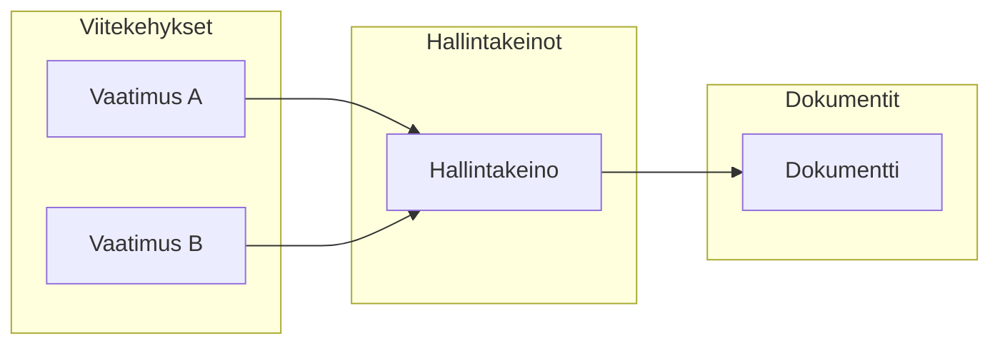

# Hallintakeinojen liittäminen

Liitä hallintakeinot vaatimuksiin, riskeihin ja asiakirjoihin vaatimustenmukaisuuskuvasi rakentamiseksi.

## Miksi liittäminen on tärkeää?

Liittäminen luo yhteydet, jotka mahdollistavat Goverin vaatimustenmukaisuuden seurannan:

## Liittäminen vaatimuksiin

### Hallintakeinosta

1. Avaa hallintakeino
2. Mene **Vaatimukset** -välilehdelle
3. Klikkaa **Liitä vaatimukset**
4. Valitse vaatimukset mistä tahansa viitekehyksestä
5. Vahvista liittäminen

### Vaatimuksesta

1. Avaa vaatimus
2. Klikkaa **Liitä hallintakeinot**
3. Valitse olemassa olevat hallintakeinot tai luo uusi
4. Vahvista liittäminen

### AI-avusteinen liittäminen

Anna tekoälyn ehdottaa relevantteja yhteyksiä:

1. Avaa hallintakeino tai vaatimus
2. Klikkaa **AI-ehdotukset**
3. Tarkista ehdotukset luottamuslukuineen
4. Hyväksy tai hylkää kukin ehdotus

:::info
AI analysoi tekstin samankaltaisuutta, olemassa olevia yhteyksiä ja alan malleja tehdäkseen ehdotuksia.
:::

## Liittäminen riskeihin

Liitä hallintakeinot riskeihin, joita ne lieventävät:

1. Avaa hallintakeino
2. Mene **Riskit** -välilehdelle
3. Klikkaa **Liitä riskit**
4. Valitse riskit rekisteristäsi
5. Vahvista liittäminen

Tämä näyttää:

- Mitkä riskit lievennetään kontrolleilla
- Hallintakeinokattavuuden riskien käsittelyssä
- Puutteet riskien lieventämisessä

## Liittäminen dokumentteihin

Liitä todistedokumentteja hallintakeinoihin:

1. Avaa hallintakeino
2. Mene **Dokumentit** -välilehdelle
3. Klikkaa **Liitä dokumentit**
4. Valitse olemassa olevat dokumentit tai lataa uusi
5. Vahvista liittäminen

### Dokumenttityypit

| Tyyppi         | Tarkoitus                        |
| -------------- | -------------------------------- |
| **Politiikat** | Muodolliset politiikkadokumentit |
| **Menettelyt** | Vaiheittaiset prosessit          |
| **Tietueet**   | Todisteet toteutuksesta          |
| **Raportit**   | Auditointi- ja arviointiraportit |

## Liittäminen tehtäviin

Liitä implementointi- ja katselmointitehtävät:

1. Avaa hallintakeino
2. Mene **Tehtävät** -välilehdelle
3. Klikkaa **Liitä tehtävät** tai **Luo tehtävä**
4. Liitä relevantit tehtävät

## Yhteyksien tarkastelu

### Hallintakeinonäkymä

Näe kaikki yhden hallintakeinon yhteydet:

- Vaatimukset-välilehti
- Riskit-välilehti
- Dokumentit-välilehti
- Tehtävät-välilehti

### Matriisinäkymä

Näe yhteydet useiden hallintakeinoen välillä:

- Viitekehys × Hallintakeino -matriisi
- Riski × Hallintakeino -matriisi

## Massaliittäminen

Liitä useita kohteita kerralla:

1. Valitse useita hallintakeinoja (valintaruutu)
2. Klikkaa **Massatoiminnot** → **Liitä**
3. Valitse kohdevaatimukset tai -riskit
4. Sovella kaikkiin valittuihin

## Parhaat käytännöt

1. **Liitä kattavasti** — Älä jätä vaatimuksia ilman yhteyksiä
2. **Käytä AI-ehdotuksia** — Säästä aikaa älykkäillä suosituksilla
3. **Tarkista säännöllisesti** — Yhteydet saattavat vaatia päivityksiä hallintakeinoen muuttuessa
4. **Dokumentoi perustelut** — Lisää kommentteja selittämään liittämispäätökset
5. **Vältä liiallista liittämistä** — Liitä vain, kun on todellinen suhde

## Seuraavat vaiheet

- [Hallintakeinoen testaus](./testing) — Varmista hallintakeinon tehokkuus
- [Kategoriat](./categories) — Järjestä hallintakeinosi
