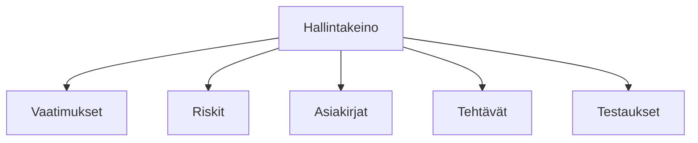

# Hallintakeinot

Hallintakeinot ovat politiikkoja, menettelyjä ja toimenpiteitä, joita organisaatiosi toteuttaa täyttääkseen vaatimustenmukaisuusvaatimukset ja lieventääkseen riskejä.

## Mikä on hallintakeino?

Hallintakeino on suojatoimenpide tai vastatoimi, joka on suunniteltu:

- Täyttämään vaatimustenmukaisuusvaatimukset
- Lieventämään tunnistettuja riskejä
- Suojaamaan organisaation omaisuutta
- Varmistamaan toiminnan eheys

## Hallintakeinokirjasto

Hallintakeinokirjastosi on keskitetty varasto kaikille työtilasi hallintakeinoille.

### Näkymät

| Näkymä              | Kuvaus                                                    |
| ------------------- | --------------------------------------------------------- |
| **Luettelonäkymä**  | Lajiteltava, suodatettava taulukko kaikista kontrolleista |
| **Kategorianäkymä** | Hallintakeinot järjestetty kategoriaan                        |
| **Mallipohjat**     | Valmiiksi rakennetut hallintakeinomallit                      |

## Hallintakeinon ominaisuudet

Jokaisella hallintakeinolla on:

| Ominaisuus            | Kuvaus                            |
| --------------------- | --------------------------------- |
| **Otsikko**           | Hallintakeinon nimi                   |
| **Kuvaus**            | Yksityiskohtainen selitys         |
| **Kategoria**         | Organisaation mukainen ryhmittely |
| **Omistaja**          | Vastuuhenkilö                     |
| **Tila**              | Implementoinnin tila              |
| **Mukautetut kentät** | Lisäseurantakentät                |

## Hallintakeinoen suhteet

Hallintakeinot yhdistyvät muihin entiteetteihin:

### Vaatimukset

- Hallintakeinot täyttävät viitekehysvaatimukset
- Yksi hallintakeino voi yhdistyä useisiin vaatimuksiin
- Viitekehyksien välinen kartoitus tuettu

### Riskit

- Hallintakeinot lieventävät tunnistettuja riskejä
- Näyttää riskin vähentämisvaikutuksen
- Linkittyy riskinarviointeihin

### Asiakirjat

- Dokumentit tukevat hallintakeinoja
- Politiikat, menettelyt, tietueet
- Versonhallinta

### Tehtävät

- Implementointitehtävät
- Katselmointi- ja auditointitehtävät
- Korjaavat toimenpiteet

## Hallintakeinon tila

Seuraa implementoinnin edistymistä:

| Tila                | Merkitys                                    |
| ------------------- | ------------------------------------------- |
| **Luonnos**         | Hallintakeino määritelty mutta ei implementoitu |
| **Käynnissä**       | Implementointi käynnissä                    |
| **Implementoitu**   | Hallintakeino on toiminnassa                    |
| **Katselmoinnissa** | Aikataulutettu katselmointiin               |
| **Vanhentunut**     | Ei enää käytössä                            |

## Keskeiset toiminnot

| Toiminto    | Kuvaus                                     |
| ----------- | ------------------------------------------ |
| **Luo**     | Lisää uusia hallintakeinoja                    |
| **Tuo**     | Massatuonti mallipohjista tai tiedostoista |
| **Yhdistä** | Linkitä vaatimuksiin ja riskeihin          |
| **Testaa**  | Varmista hallintakeinon tehokkuus              |
| **Vie**     | Luo hallintakeinoraportteja                    |

## Seuraavat vaiheet

- [Hallintakeinoen luominen](./creating-controls) — Lisää hallintakeinoja kirjastoosi
- [Hallintakeinoen yhdistäminen](./mapping) — Linkitä hallintakeinot vaatimuksiin ja riskeihin
- [Hallintakeinoen testaus](./testing) — Varmista hallintakeinon tehokkuus
