# Hallintakeinoen testaus

Varmista testauksella, että hallintakeinosi toimivat tehokkaasti.

## Miksi testata hallintakeinoja?

Hallintakeinoen testaus varmistaa:

- Hallintakeinot on implementoitu suunnitellusti
- Hallintakeinot toimivat tehokkaasti
- Todisteita on olemassa auditoijille
- Puutteet tunnistetaan ajoissa

## Testityypit

| Tyyppi                        | Kuvaus                                         | Tiheys              |
| ----------------------------- | ---------------------------------------------- | ------------------- |
| **Suunnittelutesti**          | Varmista, että hallintakeino on suunniteltu oikein | Kerran, muutoksissa |
| **Toiminnallinen testi**      | Varmista, että hallintakeino toimii käytännössä    | Säännöllisesti      |
| **Vaatimustenmukaisuustesti** | Varmista vaatimusten noudattaminen             | Tarvittaessa        |

## Testien luominen

1. Avaa hallintakeino
2. Mene **Testit** -välilehdelle
3. Klikkaa **Lisää testi**
4. Määritä testin tiedot:
   - Testin nimi
   - Testausmenettely
   - Odotetut tulokset
   - Tiheys

## Testitulosten kirjaaminen

Testin suorittamisen jälkeen:

1. Avaa testi
2. Klikkaa **Kirjaa tulos**
3. Syötä:
   - Testauspäivämäärä
   - Testaajan nimi
   - Tulos (Hyväksytty/Hylätty)
   - Todisteet/huomiot
4. Tallenna tulos

## Testin tila

| Tila               | Merkitys                                        |
| ------------------ | ----------------------------------------------- |
| 🟢 **Hyväksytty**  | Hallintakeino toimii tehokkaasti                    |
| 🔴 **Hylätty**     | Hallintakeino ei toimi odotetulla tavalla           |
| 🟡 **Osittainen**  | Jotkut kohdat hyväksytty, toiset vaativat työtä |
| ⚪ **Ei testattu** | Testiä ei ole vielä suoritettu                  |

## Testihistoria

Tarkastele historiallisia testituloksia:

- Trendi ajan myötä
- Hyväksymis-/hylkäysprosentit
- Testaajan tiedot
- Todistelinkit

## Testien aikataulutus

Aseta toistuvia testejä:

1. Avaa hallintakeino
2. Mene **Testit** -välilehdelle
3. Klikkaa **Aikatauluta**
4. Aseta tiheys (kuukausittain, neljännesvuosittain, vuosittain)
5. Määritä vastuutestaaja

## Korjaavat toimenpiteet

Kun testit epäonnistuvat:

1. Dokumentoi epäonnistuminen
2. Luo korjaava toimenpide (tehtävä)
3. Määritä hallintakeinon omistajalle
4. Seuraa valmistumiseen asti
5. Testaa uudelleen korjauksen jälkeen

```mermaid
flowchart LR
    A[Testi] --> B{Hyväksytty?}
    B -->|Kyllä| C[Dokumentoi]
    B -->|Ei| D[Korjaa]
    D --> E[Testaa uudelleen]
    E --> B
```

## Parhaat käytännöt

1. **Testaa säännöllisesti** — Älä odota auditointeja
2. **Dokumentoi kaikki** — Säilytä todisteet kaikista testeistä
3. **Käytä otantaa** — Testaa otoksia suurivolyymisille hallintakeinoille
4. **Riippumaton testaus** — Anna jonkun muun kuin omistajan testata
5. **Seuraa epäonnistumisia** — Seuraa korjauksia loppuun asti

## Seuraavat vaiheet

- [Kategoriat](./categories) — Järjestä hallintakeinosi
- [Riskinarvioinnit](../risks/risk-assessments) — Linkitä testaus riskienhallintaan
