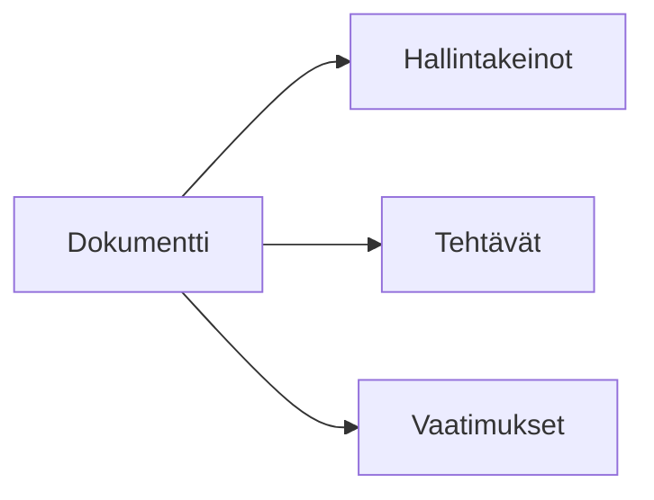

# Dokumenttien yleiskatsaus

Dokumentit Goverissa toimivat todisteina kontrolleistasi ja vaatimustenmukaisuustoimistasi.

## Mitä ovat dokumentit?

Dokumentit ovat tiedostoja ja sisältöä, joka tukee vaatimustenmukaisuusohjelmaasi:

- Politiikat ja menettelyt
- Todistetietueet
- Auditointiraportit
- Koulutusmateriaalit
- Sopimukset

## Dokumenttityypit

| Tyyppi         | Kuvaus                                       |
| -------------- | -------------------------------------------- |
| **Ladattu**    | Goveriin ladatut tiedostot (PDF, Word, jne.) |
| **Luotu**      | Goverin editorilla kirjoitetut dokumentit    |
| **Linkitetty** | Viittaukset ulkoisiin dokumentteihin         |

## Dokumenttikirjasto

Siirry kohtaan **Dokumentit** nähdäksesi dokumenttikirjastosi.

### Näkymät

- **Luettelonäkymä** — Lajiteltava, suodatettava taulukko
- **Kategorianäkymä** — Järjestetty kategorioittain

### Ominaisuudet

| Ominaisuus    | Kuvaus                            |
| ------------- | --------------------------------- |
| **Otsikko**   | Asiakirjan nimi                   |
| **Kuvaus**    | Sisällön yhteenveto               |
| **Kategoria** | Organisaation mukainen ryhmittely |
| **Omistaja**  | Vastuuhenkilö                     |
| **Versio**    | Asiakirjan versio                 |
| **Tila**      | Luonnos, Julkaistu, Arkistoitu    |

## Dokumenttien suhteet

Dokumentit yhdistyvät:

- **Hallintakeinot** — Todisteet tukevat hallintakeinoja
- **Tehtävät** — Tehtävien tuotokset
- **Vaatimukset** — Suorat vaatimustodisteet

## Keskeiset toiminnot

| Toiminto       | Kuvaus                             |
| -------------- | ---------------------------------- |
| **Lataa**      | Lisää tiedostoja kirjastoon        |
| **Luo**        | Kirjoita dokumentteja Goverissa    |
| **Yhdistä**    | Linkitä hallintakeinoihin ja tehtäviin |
| **Esikatsele** | Tarkastele dokumentin sisältöä     |
| **Vie**        | Lataa dokumentteja                 |

## Seuraavat vaiheet

- [Dokumenttien lataaminen](./uploading) — Lisää tiedostoja Goveriin
- [Dokumenttieditori](./editor) — Luo dokumentteja Goverissa
- [Dokumenttien yhdistäminen](./mapping) — Linkitä dokumentteja hallintakeinoihin
