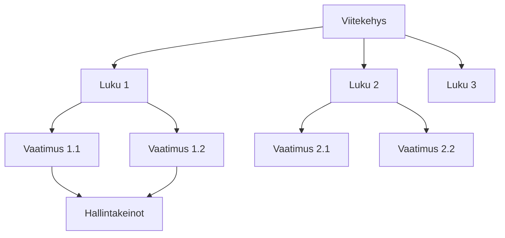

# Viitekehykset

Viitekehykset ovat vaatimustenmukaisuuden hallinnan perusta Goverissa. Ne määrittelevät vaatimukset, jotka organisaatiosi on täytettävä.

## Mikä on viitekehys?

Vaatimustenmukaisuuden viitekehys on jäsennelty kokoelma ohjeita, vaatimuksia ja parhaita käytäntöjä, joita organisaatiot noudattavat saavuttaakseen ja ylläpitääkseen vaatimustenmukaisuuden säädösten, standardien tai alan käytäntöjen kanssa.

## Tuetut viitekehykset

Gover tukee laajaa valikoimaa viitekehyksiä:

| Viitekehys       | Tyyppi     | Kuvaus                                           |
| ---------------- | ---------- | ------------------------------------------------ |
| **ISO 27001**    | Standardi  | Tietoturvallisuuden hallintajärjestelmä          |
| **GDPR**         | Asetus     | EU:n tietosuoja-asetus                           |
| **NIS2**         | Direktiivi | EU:n verkko- ja tietoturvadirektiivi             |
| **Kybermittari** | Arviointi  | Suomalainen kyberturvallisuuden arviointityökalu |
| **CRA**          | Asetus     | EU:n kyberkestävyyssäädös                        |
| **ISO 9001**     | Standardi  | Laadunhallintajärjestelmä                        |
| **ISO 14001**    | Standardi  | Ympäristöjohtamisjärjestelmä                     |
| **ISO 45001**    | Standardi  | Työterveys ja -turvallisuus                      |
| **ISO 42001**    | Standardi  | Tekoälyn hallintajärjestelmä                     |

## Viitekehysnäkymät

### Korttinäkymä

Näe kaikki viitekehykset yhdellä silmäyksellä valmiusindikaattoreineen.

### Puunäkymä

Selaa vaatimusten hierarkkista rakennetta viitekehyksen sisällä.

### Vaatimusluettelo

Näe kaikki vaatimukset suodatettavassa ja lajiteltavassa luettelossa.

## Valmiuden seuranta

Jokainen viitekehys näyttää vaatimustenmukaisuuden valmiuden:

- **Valmius %** — Prosenttiosuus vaatimuksista, joihin on liitetty hallintakeinot
- **Tilaindikaattorit** — Visuaalinen edistyminen kullekin osiolle
- **Gap-analyysi** — Tunnista kartoittamattomat vaatimukset

## Keskeiset toiminnot

| Toiminto                   | Kuvaus                                     |
| -------------------------- | ------------------------------------------ |
| **Lisää viitekehys**       | Tuo mallipohjista tai luo mukautettu       |
| **Tarkastele vaatimuksia** | Selaa vaatimushierarkiaa                   |
| **Liitä hallintakeinot**     | Liitä hallintakeinot vaatimuksiin            |
| **Seuraa edistymistä**     | Monitoroi vaatimustenmukaisuuden valmiutta |
| **Vie**                    | Luo vaatimustenmukaisuusraportteja         |

## Seuraavat vaiheet

- [Viitekehysten lisääminen](./adding-frameworks) — Opi lisäämään viitekehyksiä
- [Vaatimukset](./requirements) — Vaatimusten kanssa työskentely
- [Valmiuden seuranta](./readiness-tracking) — Monitoroi edistymistäsi
