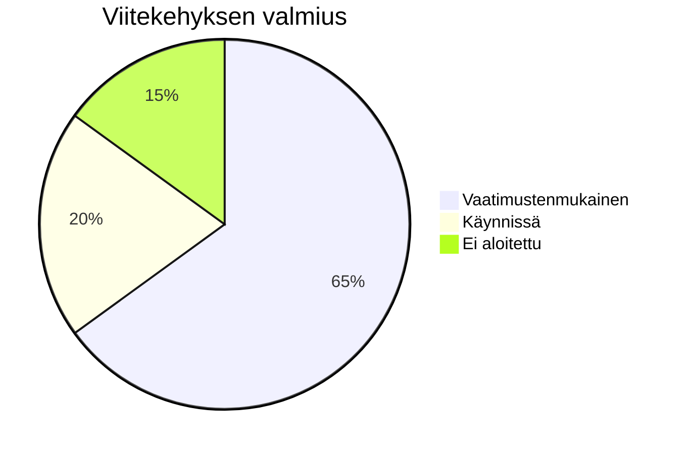

# Valmiuden seuranta

Monitoroi organisaatiosi vaatimustenmukaisuuden edistymistä kaikissa viitekehyksissä.

## Valmiuden yleiskatsaus

Gover laskee valmiuden sen perusteella, kuinka monella vaatimuksella on liitettyjä hallintakeinoja.



## Viitekehyksen valmius

Jokainen viitekehys näyttää:

- **Kokonaisvalmius %** — Prosenttiosuus käsitellyistä vaatimuksista
- **Osiokohtainen erittely** — Valmius per luku/osio
- **Trendi** — Edistyminen ajan myötä

### Valmiuslaskenta

```
Valmius = (Vaatimukset kontrolleilla / Vaatimusten kokonaismäärä) × 100
```

:::note
Vaatimukset, jotka on merkitty "Ei sovellettavissa", suljetaan pois laskennasta.
:::

## Kojelaudan mittarit

Koti-näkymä näyttää:

| Mittari                       | Kuvaus                                       |
| ----------------------------- | -------------------------------------------- |
| **Viitekehykset yhteensä**    | Aktiivisten viitekehysten määrä              |
| **Keskiarvovalmius**          | Keskimääräinen valmius viitekehysten välillä |
| **Vaatimusvaje**              | Kartoittamattomien vaatimusten määrä         |
| **Viimeaikainen edistyminen** | Muutokset viimeisen 30 päivän aikana         |

## Gap-analyysi

Tunnista vaatimustenmukaisuuspuutteet nopeasti:

1. Siirry viitekehykseen
2. Suodata vaatimukset tilalla **Tila: Ei aloitettu (Not Started)**
3. Tarkista kartoittamattomat vaatimukset
4. Priorisoi riskin tai auditointiaikataulun perusteella

## Edistymisen seuranta

### Aikajananäkymä

Näe miten valmius on muuttunut ajan myötä:

- Viikoittaiset/kuukausittaiset edistymiskaaviot
- Virstanpylväsmerkinnät
- Trendianalyysi

### Tapahtumavirta

Seuraa viimeaikaisia vaatimustenmukaisuustoimia:

- Uudet hallintakeinoyhteydet
- Tilamuutokset
- Tiimin kontribuutiot

## Raportointi

Luo vaatimustenmukaisuusraportteja:

1. Mene kohtaan **Viitekehykset** → valitse viitekehys
2. Klikkaa **Vie** tai **Raportit**
3. Valitse raporttityyppi:
   - **Valmiusyhteenveto** — Ylätason yleiskatsaus
   - **Gap-raportti** — Kartoittamattomat vaatimukset
   - **Koko raportti** — Täydellinen vaatimustenmukaisuustila

### Raporttimuodot

- PDF — Jakamiseen ja tulostamiseen
- Excel — Jatkoanalyysiin
- CSV — Dataintegraatioon

## Parhaat käytännöt

1. **Aseta tavoitteet** — Määritä valmiustavoitteet ja aikataulut
2. **Säännölliset katselmukset** — Tarkista edistyminen viikoittain
3. **Käsittele puutteet ajoissa** — Älä jätä kartoittamattomia vaatimuksia auditointiin asti
4. **Juhlista virstanpylväitä** — Tunnusta tiimin edistyminen

## Seuraavat vaiheet

- [Hallintakeinoen yleiskatsaus](../controls/overview) — Hallitse hallintakeinokirjastoasi
- [Riskienhallinta](../risks/overview) — Ymmärrä riskiseuranta
