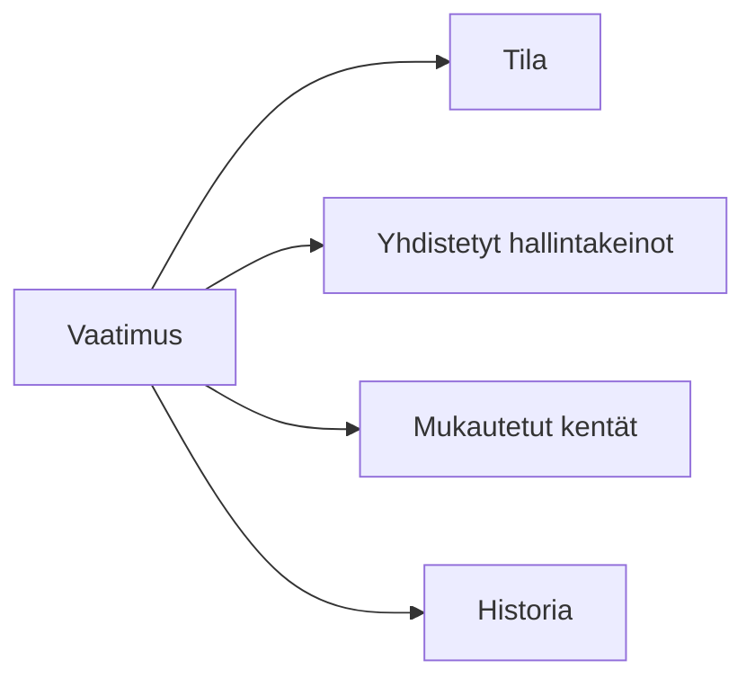

# Vaatimukset

Vaatimukset ovat viitekehyksen kriteereitä, jotka organisaatiosi on täytettävä.

## Vaatimusten ymmärtäminen

Jokainen vaatimus edustaa tiettyä vaatimustenmukaisuusvelvoitetta. Vaatimukset on järjestetty hierarkkisesti viitekehysten sisällä.

## Vaatimusten tarkastelu

### Puunäkymä

Selaa vaatimuksia niiden hierarkkisessa rakenteessa:

- Laajenna/pienennä kategoriat
- Näe valmiustila jokaisella tasolla
- Nopea pääsy vaatimuksen tietoihin

### Luettelonäkymä

Tarkastele kaikkia vaatimuksia suodatettavassa taulukossa:

- Lajittele minkä tahansa sarakkeen mukaan
- Suodata tilan, kategorian tai mukautettujen kenttien mukaan
- Massatoiminnot käytettävissä

## Vaatimuksen tiedot

Klikkaa mitä tahansa vaatimusta nähdäksesi sen tiedot:

| Osio                  | Kuvaus                          |
| --------------------- | ------------------------------- |
| **Yleiskatsaus**      | Otsikko, kuvaus ja ohjeistus    |
| **Hallintakeinot**        | Yhdistetyt hallintakeinot tiloineen |
| **Mukautetut kentät** | Lisäseurantakentät              |
| **Historia**          | Muutosloki ja tarkastuspolku    |
| **Kommentit**         | Tiimikeskustelut                |

## Hallintakeinoen yhdistäminen vaatimuksiin

Goverin ydinprosessi on hallintakeinoen yhdistäminen vaatimuksiin.

### Lisää hallintakeinoyhteys

1. Avaa vaatimus
2. Klikkaa **Yhdistä hallintakeinot**
3. Valitse:
   - **Olemassa olevat hallintakeinot** — Valitse hallintakeinokirjastostasi
   - **Luo uusi** — Luo hallintakeino ja yhdistä se
   - **AI-ehdotukset** — Saat älykkäitä yhdistämissuosituksia

<!-- TODO: Add GIF showing control mapping -->

### AI-avusteinen yhdistäminen

Goverin tekoäly voi ehdottaa relevantteja hallintakeinoja:

1. Klikkaa **AI-ehdotukset** yhdistämisikkunassa
2. Tarkista ehdotetut hallintakeinot luottamuslukuineen
3. Hyväksy ehdotukset luodaksesi yhteydet
4. Muokkaa tai hylkää tarpeen mukaan

:::info
AI-ehdotukset perustuvat vaatimustekstiin, olemassa oleviin yhteyksiin ja alan parhaisiin käytäntöihin.
:::

## Vaatimuksen tila

Vaatimukset näyttävät vaatimustenmukaisuuden tilansa:

| Tila                       | Merkitys                                      |
| -------------------------- | --------------------------------------------- |
| 🔴 **Ei aloitettu**        | Ei hallintakeinoja yhdistetty                     |
| 🟡 **Käynnissä**           | Osa kontrolleista yhdistetty, ei valmis       |
| 🟢 **Vaatimustenmukainen** | Kaikki tarvittavat hallintakeinot paikallaan      |
| ⚪ **Ei sovellettavissa**  | Merkitty ei-sovellettavaksi organisaatiossasi |

## Vaatimusten suodattaminen

Käytä suodattimia löytääksesi tietyt vaatimukset:

- **Tila** — Suodata vaatimustenmukaisuuden tilan mukaan
- **Kategoria** — Suodata viitekehyksen osion mukaan
- **Haku** — Kokotekstihaku otsikoissa ja kuvauksissa
- **Mukautetut kentät** — Suodata mukautettujen kenttien arvojen mukaan

## Massatoiminnot

Valitse useita vaatimuksia:

- Vie CSV/Excel-muotoon
- Päivitä mukautettuja kenttiä massana
- Luo raportteja

## Parhaat käytännöt

1. **Järjestelmällinen työskentely** — Käsittele vaatimukset osio kerrallaan
2. **Käytä AI-ehdotuksia** — Anna tekoälyn auttaa relevanttien hallintakeinoen tunnistamisessa
3. **Dokumentoi perustelut** — Lisää kommentteja selittämään yhdistämispäätökset
4. **Tarkista säännöllisesti** — Vaatimukset saattavat vaatia uudelleenarviointia hallintakeinoen muuttuessa

## Seuraavat vaiheet

- [Valmiuden seuranta](./readiness-tracking) — Monitoroi kokonaisvalmiutta
- [Hallintakeinoen yleiskatsaus](../controls/overview) — Opi hallintakeinoen hallinnasta
