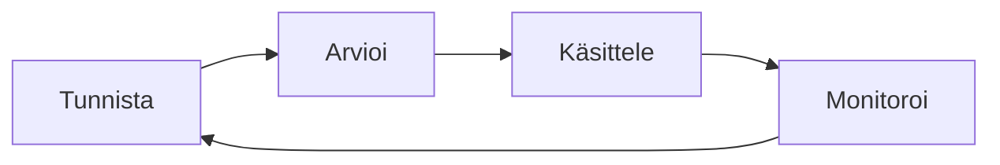
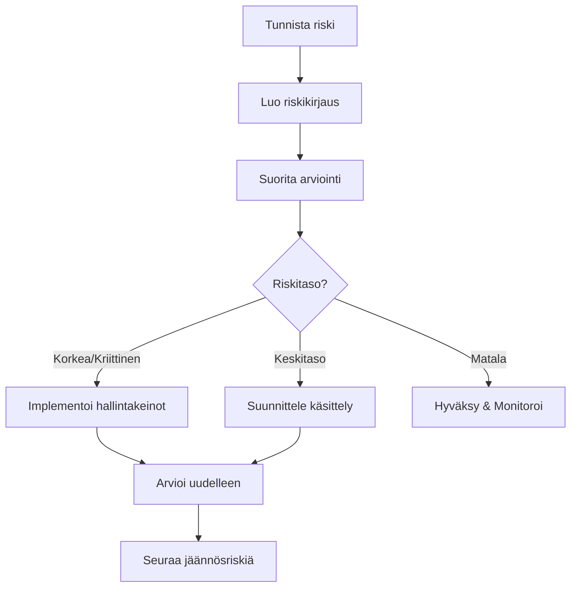

# Riskienhallinnan yleiskatsaus

Gover tarjoaa kattavat riskienhallintaominaisuudet organisaatioriskien tunnistamiseen, arviointiin ja käsittelyyn.

## Mitä on riskienhallinta?

Riskienhallinta on prosessi, jossa:

1. **Tunnistetaan** potentiaaliset uhat ja haavoittuvuudet
2. **Arvioidaan** niiden todennäköisyys ja vaikutus
3. **Käsitellään** riskejä hallintakeinoen ja muiden toimenpiteiden avulla
4. **Monitoroidaan** riskitasoja ajan myötä

## Riskienhallinta Goverissa

### Riskirekisteri

Kaikkien tunnistettujen riskien keskitetty varasto, jossa on:

- Riskikuvaukset
- Kategoriat ja tunnisteet
- Omistajuus
- Käsittelyn tila

### Riskinarvioinnit

Arvioi riskejä käyttäen:

- Mukautettavia pisteytyskenttiä
- Vaikutus- ja todennäköisyysluokituksia
- Laskennallisia riskipisteitä
- Riskitasokartoituksia

### Riskien käsittely

Käsittele riskejä seuraavin tavoin:

- Lieventäminen (implementoi hallintakeinot)
- Hyväksyminen (tiedosta ja monitoroi)
- Siirtäminen (vakuutus, ulkoistaminen)
- Välttäminen (poista riskin lähde)

## Keskeiset käsitteet

| Käsite                  | Kuvaus                                            |
| ----------------------- | ------------------------------------------------- |
| **Kokonaisriski**       | Riskitaso ennen hallintakeinoja                       |
| **Jäännösriski**        | Riskitaso hallintakeinoen soveltamisen jälkeen        |
| **Riskinottohalukkuus** | Riskitaso, jonka organisaatio hyväksyy            |
| **Riskipisteet**        | Laskettu arvo arviointikenttien perusteella       |
| **Riskitaso**           | Kategoria (Kriittinen, Korkea, Keskitaso, Matala) |

## Riskinäkymät

### Luettelonäkymä

Kaikki riskit suodatettavassa ja lajiteltavassa taulukossa.

### Lämpökartta

Visuaalinen esitys riskeistä vaikutuksen ja todennäköisyyden mukaan.

### Yleiskatsausnäkymä

Yhteenvetomittarit ja trendit.

## Riskityönkulku

## Seuraavat vaiheet

- [Riskirekisteri](./risk-register) — Riskien hallinta
- [Riskinarvioinnit](./risk-assessments) — Riskien arviointi
- [Riskien käsittely](./risk-treatment) — Riskien käsittely
- [Lämpökartta](./heatmap) — Riskien visualisointi
