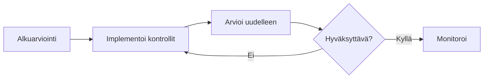

# Riskinarvioinnit

Riskinarvioinnit arvioivat tunnistettujen riskien todennäköisyyttä ja vaikutusta.

## Mikä on riskinarviointi?

Riskinarviointi on jäsennelty arviointi, joka määrittää:

- Kuinka todennäköisesti riski toteutuu?
- Mikä olisi vaikutus, jos se toteutuisi?
- Mikä on kokonaisriskipisteytys?
- Mitä riskitasoa tämä edustaa?

## Arviointityypit

### Kokonaisriskin arviointi

Arvioi riskin **ennen** kontrollien soveltamista.

- Edustaa "raakaa" riskitasoa
- Vertailukohta kontrollien tehokkuuden mittaamiselle

### Jäännösriskin arviointi

Arvioi riskin **jälkeen**, kun kontrollit on sovellettu.

- Näyttää nykyisen riskialtistuksen
- Ohjaa jatkokäsittelypäätöksiä

## Arvioinnin suorittaminen

1. Avaa riski
2. Mene **Arvioinnit** -välilehdelle
3. Klikkaa **Uusi arviointi**
4. Valitse arviointityyppi (Kokonaisriski/Jäännösriski)
5. Täytä arviointilomake
6. Tallenna

<!-- TODO: Add GIF showing assessment process -->

## Arviointikentät

Gover käyttää mukautettavia arviointikenttiä:

### Oletuskentät

| Kenttä             | Kuvaus                    | Asteikko |
| ------------------ | ------------------------- | -------- |
| **Todennäköisyys** | Esiintymistodennäköisyys  | 1-5      |
| **Vaikutus**       | Vakavuus, jos se tapahtuu | 1-5      |

### Mukautetut kentät

Lisää mukautettuja kenttiä metodologiaasi varten:

- Taloudellinen vaikutus
- Mainehaitta
- Operatiivinen vaikutus
- Palautumisaika
- Havaitsemiskyky

## Riskipisteiden laskenta

Riskipisteet lasketaan kaavoilla:

### Yksinkertainen kaava

```
Riskipisteet = Todennäköisyys × Vaikutus
```

### Mukautetut kaavat

Luo monimutkaisia kaavoja käyttäen:

- Useita kenttiä
- Painotettuja laskelmia
- Mukautettuja operaattoreita

Esimerkki:

```
Pisteet = (Todennäköisyys × 0.4) + (Vaikutus × 0.6)
```

## Riskitasot

Pisteet yhdistyvät riskitasoihin:

| Pistealue | Taso         | Väri         |
| --------- | ------------ | ------------ |
| 20-25     | Kriittinen   | 🔴 Punainen  |
| 15-19     | Korkea       | 🟠 Oranssi   |
| 10-14     | Keskitaso    | 🟡 Keltainen |
| 5-9       | Matala       | 🟢 Vihreä    |
| 1-4       | Hyvin matala | 🔵 Sininen   |

:::info
Riskitasokartoituksia voidaan konfiguroida kohdassa **Riskit** → **Asetukset** → **Kaavat**.
:::

## Arviointihistoria

Seuraa arviointeja ajan myötä:

- Tarkastele kaikkia menneitä arviointeja
- Näe pistetrendit
- Vertaa kokonaisriskiä vs jäännösriskiä
- Tunnista paranevat/huononevat riskit



## Parhaat käytännöt

1. **Ole johdonmukainen** — Käytä samoja kriteerejä arvioinneissa
2. **Dokumentoi perustelut** — Selitä pisteytyspäätöksesi
3. **Arvioi säännöllisesti uudelleen** — Riskitasot muuttuvat ajan myötä
4. **Vertaa kokonaisriskiä/jäännösriskiä** — Mittaa kontrollien tehokkuutta
5. **Osallista sidosryhmät** — Pyydä syötettä riskien omistajilta

## Seuraavat vaiheet

- [Riskien käsittely](./risk-treatment) — Käsittele arvioidut riskit
- [Lämpökartta](./heatmap) — Visualisoi riskijakauma
- [Kaavat](./formulas) — Konfiguroi pisteytyskaavat
