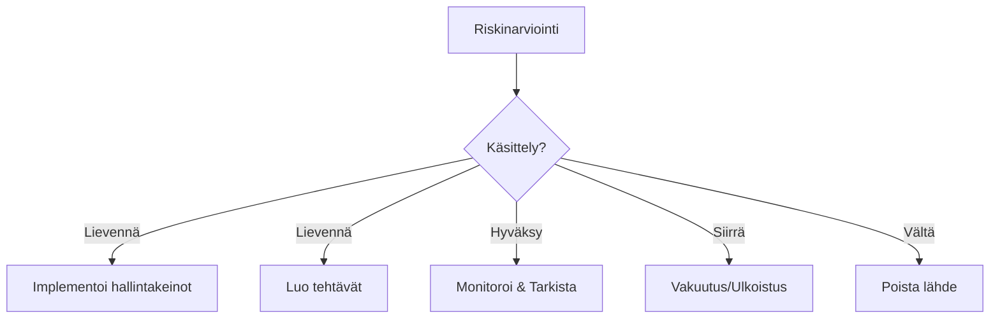

# Riskien käsittely

Riskien käsittely on prosessi, jossa tunnistettuihin riskeihin puututaan niiden vähentämiseksi hyväksyttävälle tasolle.

## Käsittelyvaihtoehdot



### Lievennä

Implementoi hallintakeinoja todennäköisyyden tai vaikutuksen vähentämiseksi.

- Yleisin käsittelytapa
- Linkittyy hallintakeinokirjastoon
- Vähentää jäännösriskiä

### Hyväksy

Tunnista riski ja monitoroi sitä.

- Matalan tason riskeille
- Riskinottohalukkuuden rajoissa
- Vaatii dokumentointia

### Siirrä

Siirrä riski kolmannelle osapuolelle.

- Vakuutukset
- Ulkoistaminen
- Sopimusjärjestelyt

### Vältä

Poista riskin lähde kokonaan.

- Lopeta riskialtis toiminta
- Muuta liiketoimintaprosessia
- Radikaalein vaihtoehto

## Käsittelyn asettaminen

1. Avaa riski
2. Mene **Yleiskatsaus** -välilehdelle
3. Valitse **Käsittely** -tyyppi
4. Dokumentoi käsittelysuunnitelma
5. Tallenna

## Käsittelysuunnitelmat

Jokaiselle käsittelylle dokumentoi:

| Elementti             | Kuvaus                                 |
| --------------------- | -------------------------------------- |
| **Käsittelytyyppi**   | Lievennä, Hyväksy, Siirrä, Vältä       |
| **Kuvaus**            | Miten riskiä käsitellään               |
| **Hallintakeinot**        | Yhdistetyt hallintakeinot (lieventämiseen) |
| **Omistaja**          | Vastuuhenkilö                          |
| **Tavoitepäivämäärä** | Milloin käsittelyn tulisi olla valmis  |
| **Tila**              | Käsittelyn edistyminen                 |

## Hallintakeinoen yhdistäminen

Lieventämiskäsittelyä varten:

1. Avaa riski
2. Mene **Hallintakeinot** -välilehdelle
3. Klikkaa **Yhdistä hallintakeinot**
4. Valitse hallintakeinot, jotka käsittelevät tätä riskiä
5. Vahvista yhdistäminen

Tämä näyttää:

- Mitkä hallintakeinot lieventävät riskiä
- Odotettu riskin väheneminen
- Puutteet kattavuudessa

## Jäännösriski

Käsittelyn jälkeen arvioi jäännösriski:

1. Implementoi suunnitellut hallintakeinot
2. Suorita jäännösriskin arviointi
3. Vertaa kokonaisriskiin
4. Varmista, että riski on riskinottohalukkuuden rajoissa

### Jäännösriskin kaava

```
Jäännösriski = Kokonaisriski - Hallintakeinon tehokkuus
```

## Käsittelytehtävät

Luo tehtäviä käsittelyn seuraamiseksi:

1. Avaa riski
2. Mene **Tehtävät** -välilehdelle
3. Klikkaa **Luo tehtävä**
4. Määritä:
   - Tehtävän otsikko
   - Tekijä
   - Määräpäivä
   - Kuvaus
5. Seuraa valmistumiseen asti

## Käsittelyn tila

| Tila            | Kuvaus                              |
| --------------- | ----------------------------------- |
| **Suunniteltu** | Käsittely tunnistettu, ei aloitettu |
| **Käynnissä**   | Käsittelyä implementoidaan          |
| **Valmis**      | Käsittely täysin implementoitu      |
| **Varmennettu** | Tehokkuus vahvistettu               |

|

## Monitorointi

Käsittelyn jälkeen:

- Aikatauluta säännölliset katselmukset
- Arvioi riskitasot uudelleen
- Päivitä käsittelyä tarvittaessa
- Dokumentoi muutokset

## Parhaat käytännöt

1. **Sovita käsittely riskiin** — Korkeat riskit vaativat vahvaa käsittelyä
2. **Dokumentoi päätökset** — Selitä miksi valitsit kunkin käsittelytavan
3. **Aseta määräajat** — Käsittelyllä tulisi olla tavoitepäivämäärät
4. **Varmista tehokkuus** — Arvioi uudelleen käsittelyn jälkeen
5. **Tarkista säännöllisesti** — Käsittelyt saattavat vaatia säätöä

## Seuraavat vaiheet

- [Lämpökartta](./heatmap) — Visualisoi riskijakauma
- [Kaavat](./formulas) — Konfiguroi riskipisteytys
