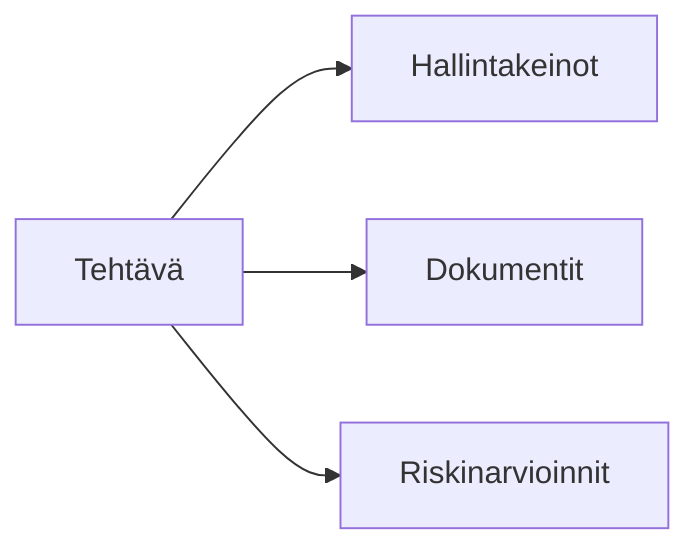
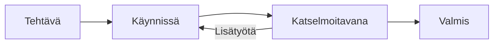

# Tehtävät

Tehtävät auttavat seuraamaan vaatimustenmukaisuustoimintoja, tehtävänantoja ja määräaikoja.

## Mitä ovat tehtävät?

Tehtävät edustavat työtehtäviä vaatimustenmukaisuusohjelmassasi:

- Hallintakeinoen implementointi
- Dokumenttien katselmoinnit
- Riskinarvioinnit
- Auditointivalmistelut
- Korjaavat toimenpiteet

## Tehtävänäkymät

### Kanban-taulu

Visuaalinen taulu sarakkeilla kullekin tilalle:

- Vedä ja pudota tilan muuttamiseksi
- Näe työn alla olevat tehtävät yhdellä silmäyksellä
- Tunnista pullonkaulat

### Luettelonäkymä

Perinteinen taulukkonäkymä:

- Lajittele minkä tahansa sarakkeen mukaan
- Suodata useilla kriteereillä
- Massatoiminnot

## Tehtävän ominaisuudet

| Ominaisuus       | Kuvaus                    |
| ---------------- | ------------------------- |
| **Otsikko**      | Tehtävän nimi             |
| **Kuvaus**       | Yksityiskohtaiset ohjeet  |
| **Tekijä**       | Vastuuhenkilö             |
| **Määräpäivä**   | Deadline                  |
| **Prioriteetti** | Korkea, Keskitaso, Matala |
| **Tila**         | Nykyinen tila             |
| **Kategoria**    | Tehtävän tyyppi           |

## Tehtävien suhteet

Tehtävät yhdistyvät:

## Tehtävien työnkulku

## Keskeiset toiminnot

| Toiminto         | Kuvaus                                |
| ---------------- | ------------------------------------- |
| **Luo**          | Lisää uusia tehtäviä                  |
| **Osoita**       | Määritä tiimin jäsenille              |
| **Päivitä tila** | Siirrä työnkulussa                    |
| **Liitä**        | Liitä hallintakeinoihin, dokumentteihin |
| **Kommentoi**    | Keskustele tiimin kanssa              |

## Seuraavat vaiheet

- [Kanban-taulu](./kanban) — Visuaalinen tehtävienhallinta
- [Luettelonäkymä](./list-view) — Taulukkomuotoinen tehtävienhallinta
- [Tehtävien tilat](./statuses) — Konfiguroi työnkulku
